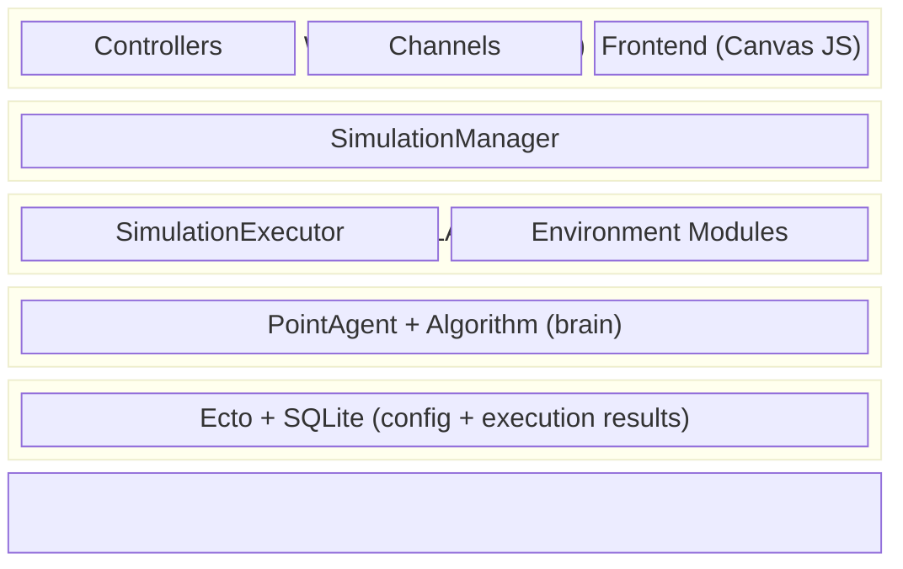

# Architecture

## Overview

Multi-agent swarm simulator built with Phoenix 1.8 / Elixir 1.15 / SQLite.
Agents are independent OTP processes (`PointAgent`) with pluggable movement
algorithms, visualized in real time via Phoenix Channels + Canvas.

## Supervision Tree

```
Simulator.Supervisor (one_for_one)
  |-- Simulator.Repo                          # Ecto / SQLite
  |-- Ecto.Migrator                           # Auto-run migrations
  |-- DNSCluster                              # DNS clustering
  |-- Phoenix.PubSub (Simulator.PubSub)       # PubSub broker
  |-- SimulatorWeb.Endpoint                   # Phoenix HTTP + WebSocket
  |-- Simulator.SimulationManager             # Singleton: tracks all executions
  |-- Registry (Simulator.Registry)           # Process registry
```

## Component Diagram

```mermaid
flowchart TD
    subgraph Supervisor["Simulator.Supervisor (one_for_one)"]
        Repo["Repo\n(SQLite)"]
        PubSub["PubSub"]
        Endpoint["Endpoint\n(HTTP + WS)"]
        Manager["SimulationManager\n(singleton)"]
        Registry["Registry"]
    end

    Endpoint --> Channel["SimulationChannel\n(per WS connection)"]
    Channel -- "start / query" --> Manager

    Manager --> Executor

    subgraph Executor["SimulationExecutor (one per simulation)"]
        Tracker["PositionTracker\n(positions)"]
        Proximity["ProximityDetector\n(neighborhood)"]
        Relay["CommunicationRelay\n(data routing)"]
        ObjServer["ObjectiveServer\n(objective, optional)"]
        Agents["PointAgent × N\n(autonomous drones)"]

        Tracker --> Proximity
        Proximity --> Relay
        Relay --> Agents
        Agents -- "report_position" --> Tracker
        Agents -- "broadcast" --> Relay
        ObjServer -- "reads positions" --> Tracker
        ObjServer -- "objective_found" --> Executor
    end
```

## Layer Diagram



> **Rule:** each layer talks only to the one immediately below it.
> Web → Manager → Executor → Agents (never Web → Agents directly).

## Components

### Core Domain (`lib/simulator/`)

| Component | Responsibility | Documentation |
|-----------|---------------|:-------------:|
| [PointAgent](core/point_agent.md) | Autonomous drone — movement, communication, local state | Detail |
| [SimulationExecutor](core/simulation_executor.md) | Physical-environment simulator — spawning, environment modules, drone connection management | Detail |
| [SimulationManager](core/simulation_manager.md) | Application ↔ executor bridge — lifecycle, queries | Detail |
| [Environment Modules](core/environment.md) | Physical world — positions, proximity, communication, objectives | Detail |

### Algorithms, Maps, and Objectives

| Component | Documentation |
|-----------|:-------------:|
| Algorithm System | [algorithms/ALGORITHMS.md](algorithms/ALGORITHMS.md) |
| Map System | [maps/MAPS.md](maps/MAPS.md) |
| Objective System | [objectives/OBJECTIVES.md](objectives/OBJECTIVES.md) |

### Web Layer (`lib/simulator_web/`)

| Component | Documentation |
|-----------|:-------------:|
| [Routes and Controllers](web/routes_and_controllers.md) | HTTP routes, CRUD, DB schema |
| [Channels](web/channels.md) | WebSocket, real-time events |
| [Frontend](web/frontend.md) | Canvas, drone grid, detail panel |

### Data Flows

| Flow | Documentation |
|------|:-------------:|
| [Real-time execution](data_flows.md) | 9 steps: CRUD → WebSocket → tick loop → render → objective detection → stats |

## Design Decisions

1. **Drone autonomy:** Each PointAgent operates only on local information, reflecting
   the constraints of a real drone. No agent accesses global state — only its
   position, its map, and messages received from the environment.
2. **Algorithms as the drone's brain:** Movement intelligence is fully encapsulated
   in the algorithm. The drone is only as smart as its algorithm, and algorithms
   only use locally available information.
3. **Executor as environment, not controller:** The Executor simulates the physical
   world (communications, sensors, collisions, objectives) — it never makes decisions
   on behalf of the drones.
4. **Manager as application bridge:** All external communication (web, channels)
   goes through the Manager. No component outside the simulation talks to Executors
   directly.
5. **Frontend as observer:** The web layer visualizes the simulation and can only
   send high-level commands (e.g., shut down N drones). It cannot manipulate
   individual agents.
6. **Static maps, unknown objectives:** Drones know the terrain (map + obstacles)
   but not the objective's location. The Executor reveals objectives via simulated
   sensor detection.
7. **Communication defined by the algorithm:** Algorithms decide what to share
   (`get_shared_data`) and how to process received data (`handle_received_data`).
   The environment only handles routing — it never inspects or modifies content.
8. **Environment as separate modules:** Physical-world simulation is split into
   specialized GenServers (PositionTracker, ProximityDetector, CommunicationRelay,
   ObjectiveServer), each handling one aspect, orchestrated by the Executor.
9. **GenServer per swarm member:** Each agent is an independent GenServer with its
   own tick loop, enabling true concurrency via the BEAM VM.
10. **Pluggable behaviours:** Algorithms, maps, and objectives are swappable via
    behaviour contracts + registries with string keys.
11. **Channels over LiveView for execution:** Real-time visualization uses Phoenix
    Channels + vanilla JS Canvas for fine-grained 30fps render control.
12. **Ephemeral execution, persisted results:** Simulations are persisted in the DB.
    Executions are in-memory OTP processes. On completion (objective found), an
    `ExecutionRun` is saved with stats (duration, ticks, finder drone, position).
13. **Disconnection as communication block:** Temporary drone disconnection is
    implemented in the environment (PositionTracker, ProximityDetector,
    CommunicationRelay), not in the PointAgent. The drone keeps running its
    algorithm with stale state — it never finds out it was disconnected, simulating
    a real network failure.
14. **Objectives as environment entities:** Objectives are entities with pluggable
    behavior (static, aim_random_walk) managed by the ObjectiveServer. Drones do
    not know the objective's location — they discover it by proximity (simulated
    sensor). When found, the Executor notifies the Manager, which persists the
    stats and notifies the frontend via PubSub.
15. **Partial reproducibility through dual seeding:** The simulation exposes
    two independent seeds — `swarm_seed`, which seeds each agent's `:rand`
    state via `:rand.seed(:exsss, {swarm_seed, agent_id, 0})` (the per-agent
    offset keeps every drone on its own stream), and `objective_seed`, which
    seeds the `ObjectiveServer` via `:rand.seed(:exsss, objective_seed)`.
    Splitting the two lets a researcher vary swarm behavior while holding
    the objective's trajectory fixed, or vice versa. Both seeds are resolved
    in `SimulationExecutor.init/1` — taken from `Simulation.objective_seed`
    / `Simulation.swarm_seed` when set, or filled independently with
    `:erlang.system_time(:nanosecond)` — and persisted on the `ExecutionRun`
    so any past run can be replayed.
    To make `(swarm_seed, agent_id)` reproducible even for algorithms that
    react to neighbor messages, every `PointAgent` buffers incoming
    `:received_data` casts in its state and drains them at tick boundary —
    sorted by sender — right before calling `compute_step`. Algorithms see
    the same input sequence across runs regardless of the order in which
    the BEAM scheduler delivered the underlying casts. The Algorithm
    behaviour is untouched; the buffering lives entirely inside `PointAgent`.
    Conceptually it mirrors real drones reading their inbox once per
    control cycle instead of reacting to every incoming radio packet.

    This makes **per-agent algorithm decisions** deterministic given identical
    local state. It does **not** make the simulation as a whole bit-identical
    across runs: the BEAM does not guarantee deterministic process scheduling,
    so two agents' ticks still interleave nondeterministically, and a
    broadcast that lands right around a tick boundary may end up in this
    tick's buffer or the next one across runs. Reproducibility of
    *algorithm decisions given identical inputs* is what the seeds plus the
    tick-boundary buffer guarantee — sufficient for thesis-level claims about
    algorithm behavior, insufficient for bit-perfect trajectory replay.
