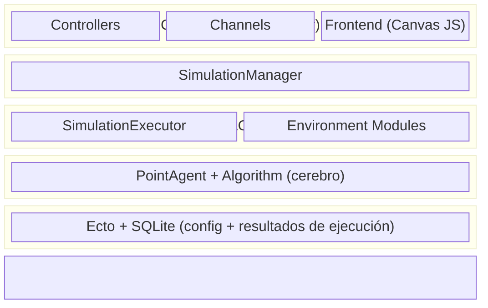

# Architecture

## Overview

Simulador multi-agente de enjambres construido con Phoenix 1.8 / Elixir 1.15 / SQLite.
Los agentes son procesos OTP independientes (`PointAgent`) con algoritmos de movimiento
pluggables, visualizados en tiempo real via Phoenix Channels + Canvas.

## Supervision Tree

```
Simulator.Supervisor (one_for_one)
  |-- Simulator.Repo                          # Ecto / SQLite
  |-- Ecto.Migrator                           # Auto-run migrations
  |-- DNSCluster                              # DNS clustering
  |-- Phoenix.PubSub (Simulator.PubSub)       # PubSub broker
  |-- SimulatorWeb.Endpoint                   # Phoenix HTTP + WebSocket
  |-- Simulator.SimulationManager             # Singleton: tracks all executions
  |-- Registry (Simulator.Registry)           # Process registry
```

## Diagrama de Componentes

```mermaid
flowchart TD
    subgraph Supervisor["Simulator.Supervisor (one_for_one)"]
        Repo["Repo\n(SQLite)"]
        PubSub["PubSub"]
        Endpoint["Endpoint\n(HTTP + WS)"]
        Manager["SimulationManager\n(singleton)"]
        Registry["Registry"]
    end

    Endpoint --> Channel["SimulationChannel\n(por conexión WS)"]
    Channel -- "start / query" --> Manager

    Manager --> Executor

    subgraph Executor["SimulationExecutor (uno por simulación)"]
        Tracker["PositionTracker\n(posiciones)"]
        Proximity["ProximityDetector\n(vecindad)"]
        Relay["CommunicationRelay\n(ruteo datos)"]
        ObjServer["ObjectiveServer\n(objetivo, opcional)"]
        Agents["PointAgent × N\n(drones autónomos)"]

        Tracker --> Proximity
        Proximity --> Relay
        Relay --> Agents
        Agents -- "report_position" --> Tracker
        Agents -- "broadcast" --> Relay
        ObjServer -- "lee posiciones" --> Tracker
        ObjServer -- "objective_found" --> Executor
    end
```

## Diagrama de Capas



> **Regla:** cada capa solo habla con la inmediata inferior.
> Web → Manager → Executor → Agents (nunca Web → Agents directamente).

## Componentes

### Core Domain (`lib/simulator/`)

| Componente | Responsabilidad | Documentación |
|------------|----------------|:-------------:|
| [PointAgent](core/point_agent.md) | Dron autónomo — movimiento, comunicación, estado local | Detalle |
| [SimulationExecutor](core/simulation_executor.md) | Simulador del entorno físico — spawning, environment modules, gestión de conexión de drones | Detalle |
| [SimulationManager](core/simulation_manager.md) | Bridge aplicación ↔ executors — lifecycle, queries | Detalle |
| [Environment Modules](core/environment.md) | Mundo físico — posiciones, proximidad, comunicación, objetivos | Detalle |

### Algoritmos, Mapas y Objetivos

| Componente | Documentación |
|------------|:-------------:|
| Sistema de Algoritmos | [algorithms/ALGORITHMS.md](algorithms/ALGORITHMS.md) |
| Sistema de Mapas | [maps/MAPS.md](maps/MAPS.md) |
| Sistema de Objetivos | [objectives/OBJECTIVES.md](objectives/OBJECTIVES.md) |

### Web Layer (`lib/simulator_web/`)

| Componente | Documentación |
|------------|:-------------:|
| [Rutas y Controllers](web/routes_and_controllers.md) | HTTP routes, CRUD, DB schema |
| [Channels](web/channels.md) | WebSocket, eventos real-time |
| [Frontend](web/frontend.md) | Canvas, drone grid, detail panel |

### Data Flows

| Flujo | Documentación |
|-------|:-------------:|
| [Ejecución en tiempo real](data_flows.md) | 9 pasos: CRUD → WebSocket → tick loop → render → detección de objetivo → stats |

## Decisiones de Diseño

1. **Autonomía del dron**: Cada PointAgent opera solo con información local, reflejando las
   restricciones de un dron real. Ningún agente accede a estado global — solo su posición,
   su mapa, y mensajes recibidos del entorno
2. **Algoritmos como cerebro del dron**: La inteligencia de movimiento está completamente
   encapsulada en el algoritmo. El dron es tan inteligente como su algoritmo, y los
   algoritmos solo usan información disponible localmente
3. **Executor como entorno, no controlador**: El Executor simula el mundo físico
   (comunicaciones, sensores, colisiones, objetivos) — nunca toma decisiones por los drones
4. **Manager como bridge de aplicación**: Toda comunicación externa (web, channels) pasa
   por el Manager. Ningún componente fuera de la simulación habla directamente con Executors
5. **Frontend como observador**: La capa web visualiza la simulación y solo puede enviar
   comandos de alto nivel (e.g., apagar N drones). No puede manipular agentes individuales
6. **Mapas estáticos, objetivos desconocidos**: Los drones conocen el terreno (mapa +
   obstáculos) pero no la ubicación de objetivos. El Executor revela objetivos a través
   de detección por sensores simulados
7. **Comunicación definida por algoritmo**: Los algoritmos deciden qué compartir
   (`get_shared_data`) y cómo procesar datos recibidos (`handle_received_data`). El entorno
   solo maneja el ruteo — nunca inspecciona ni modifica el contenido
8. **Entorno como módulos separados**: La simulación del mundo físico se divide en
   GenServers especializados (PositionTracker, ProximityDetector, CommunicationRelay,
   ObjectiveServer), cada uno manejando un aspecto, orquestados por el Executor
9. **GenServer por miembro del enjambre**: Cada agente es un GenServer independiente con
   su propio tick loop, habilitando concurrencia real via la VM de BEAM
10. **Behaviours pluggables**: Algoritmos, mapas y objetivos son intercambiables via
    contratos de behaviour + registries con keys string
11. **Channels sobre LiveView para ejecución**: La visualización real-time usa Phoenix
    Channels + vanilla JS Canvas para control fino del renderizado a 30fps
12. **Ejecución efímera, resultados persistidos**: Las simulaciones se persisten en la DB.
    Las ejecuciones son procesos OTP en memoria. Al completarse (objetivo encontrado), se
    guarda un `ExecutionRun` con estadísticas (duración, ticks, dron finder, posición)
13. **Desconexión como bloqueo de comunicación**: La desconexión temporal de un dron se
    implementa en el entorno (PositionTracker, ProximityDetector, CommunicationRelay),
    no en el PointAgent. El dron sigue ejecutando su algoritmo con estado obsoleto —
    nunca se entera de que fue desconectado, simulando una falla real de red
14. **Objetivos como entidades del entorno**: Los objetivos son entidades con comportamiento
    pluggable (static, aim_random_walk) gestionadas por el ObjectiveServer. Los drones no
    conocen la ubicación del objetivo — lo descubren por proximidad (sensor simulado). Al
    encontrarlo, el Executor notifica al Manager, que persiste las estadísticas y notifica
    al frontend via PubSub
