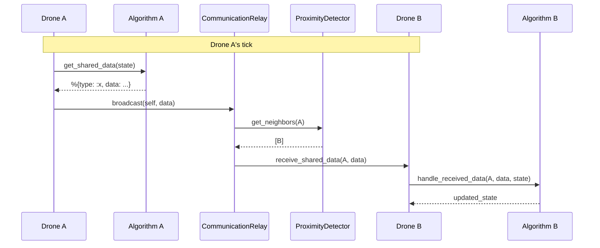
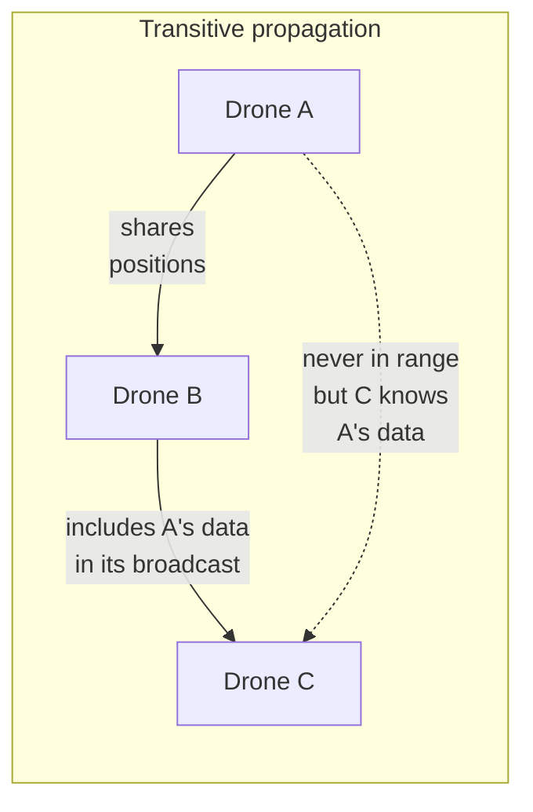

# Algorithm System

Algorithms are the brain of every drone. They define how it moves, what information
it shares with neighbors, and how it processes the information it receives. Each
algorithm is an Elixir module implementing the `Simulator.Algorithm` behaviour.

## Behaviour and Callbacks

### `compute_step(state)` — required

Computes the drone's next step. Receives the full agent state and returns
`{new_position, updated_state}`.

**Input state (`state`):**
- `state.position` — current position `%{x, y}`
- `state.map` — `%Simulator.Maps.MapParams{width, height, structures}`
- `state.neighbors` — `%{pid => %{x, y}}` drones detected within range
- `state.id` — numeric identifier of the drone
- Any additional key the algorithm has added in previous ticks

**Return:**
- `new_position` — `%{x: integer(), y: integer()}`
- `updated_state` — agent state with the algorithm's internal keys updated

### `get_shared_data(state)` — optional

Defines what information the drone shares with its neighbors on every tick. The
data is sent to the `CommunicationRelay`, which delivers it only to drones within
the detection radius.

- Returns a `map()` with the data to share
- Default: `%{}` (shares nothing)

### `handle_received_data(sender, data, state)` — optional

Processes data received from a neighboring drone. Called by the agent when the
`CommunicationRelay` delivers a message.

- `sender` — PID of the sending drone
- `data` — the map returned by the sender's `get_shared_data/1`
- `state` — agent's current state
- Returns the updated state
- Default: state unchanged

### `format_state(algo_state)` — optional

Prepares the algorithm state for external consumption (drone detail panel).
Must return a structured map with two keys:

- `:detail_fields` — list of fields to show, each with `:label`, `:value`, and `:type`
- `:overlay` — `nil` or a map with `:cells` (list of `%{x, y, intensity}`) and `:color` (RGB string)

**Supported field types:**

| Type | Frontend rendering |
|------|--------------------|
| `"text"` | Value as a plain string |
| `"position"` | `(x, y)` from a `%{x, y}` map |
| `"badge"` | Styled badge/tag |
| `"boolean"` | "Yes" / "No" |

**Example:**

```elixir
@impl true
def format_state(algo_state) do
  %{
    detail_fields: [
      %{label: "Target", value: %{x: 120, y: 340}, type: "position"},
      %{label: "Role", value: "alpha", type: "badge"},
      %{label: "Visited Cells", value: 142, type: "text"},
      %{label: "Objective Found", value: true, type: "boolean"}
    ],
    overlay: %{
      cells: [%{x: 0, y: 0, intensity: 0.5}],
      color: "239, 68, 68"
    }
  }
end
```

- `algo_state` — algorithm state (without system keys like `:position`, `:neighbors`, etc.)
- Default: `%{detail_fields: [], overlay: nil}` (panel shows only position and neighbors)

## State Rules

Algorithms persist state between ticks by adding keys to the agent's state map. On
every call to `compute_step/1`, the algorithm receives its previous state and returns
the updated one. Important rules:

1. **Do not modify system keys** — `:position`, `:map`, `:neighbors`, `:id`, `:algorithm`
   are managed by `PointAgent`. The algorithm only reads these keys.
2. **Always return the state** — even when unchanged, return `state` in the tuple.
3. **Own keys** — each algorithm uses its own keys (e.g., `:target`, `:velocity`,
   `:pheromone_grid`). There is no conflict between algorithms because only one runs per agent.
4. **Lazy initialization** — use `Map.get(state, :key) || initial_value` to initialize
   state on the first tick, with no need for a separate init step.

## Communication System





Communication between drones is decentralized and range-limited:

1. **Broadcast** — on every tick, `PointAgent` calls the algorithm's `get_shared_data(state)`
   and sends the result to the `CommunicationRelay`.
2. **Delivery** — the `CommunicationRelay` queries the `ProximityDetector` for the
   sender's neighbors and delivers the message only to drones within the detection radius.
3. **Reception** — when a drone receives a message, `PointAgent` calls the algorithm's
   `handle_received_data(sender, data, state)` to update the state.

Information propagates transitively: if A shares with B, and B includes A's data in
its own broadcast, C can receive information from A through B without ever having
been in A's range.

### Communication patterns

| Pattern | Example | Merge |
|---------|---------|-------|
| Position broadcast | PSO, GWO | Store last known position |
| Per-source knowledge | HeatmapWalk | `KnowledgeStore` — merge by original PID, decay per tick |
| Shared grid | AntColony | `max` per cell — idempotent, no echo |
| One-time event | PSO objective found | Store once, ignore duplicates |

## Invocation from PointAgent

`PointAgent` is a GenServer that runs the cycle every tick (~30ms):

1. `algorithm.compute_step(state)` → updates position and state
2. `Algorithm.shared_data(algorithm, state)` → obtains data to share
3. Sends data to the `CommunicationRelay`
4. On message reception: `Algorithm.receive_data(algorithm, sender, data, state)`

The helpers in `Simulator.Algorithm` (`shared_data/2`, `receive_data/4`, `format_state/2`)
check whether the callback is implemented before calling it, using `function_exported?/3`.

## Algorithm Registry

Algorithms are registered in `Simulator.Algorithms` (`lib/simulator/algorithms/algorithms.ex`):

```elixir
@available_algorithms %{
  "aim_random_walk" => AimRandomWalk,
  "ant_colony" => AntColony,
  "grey_wolf" => GreyWolf,
  "heatmap_walk" => HeatmapWalk,
  "particle_swarm" => ParticleSwarm,
  "random_walk" => RandomWalk,
  "static" => Static
}
```

- `get_algorithm/1` accepts strings (looked up in the registry) or atom modules (returned as-is)
- If the string is not found, `RandomWalk` is used as the default

## Implementing a New Algorithm

### Basic algorithm (movement only)

1. Create a module under `lib/simulator/algorithms/impl/`:

```elixir
defmodule Simulator.Algorithms.MyAlgorithm do
  @moduledoc "Description of the algorithm."
  @behaviour Simulator.Algorithm

  alias Simulator.Algorithms.Helpers.Geometry

  @impl true
  def compute_step(%{position: position, map: map} = state) do
    # Compute new position
    new_position = %{x: ..., y: ...}
    {new_position, state}
  end
end
```

2. Register it in `@available_algorithms` in `lib/simulator/algorithms/algorithms.ex`

### Algorithm with internal state

To persist state between ticks (target, velocity, accumulated data):

```elixir
@impl true
def compute_step(%{position: position, map: map} = state) do
  target = Map.get(state, :target) || generate_target(map)
  # ... movement logic
  {new_position, Map.put(state, :target, new_target)}
end
```

### Algorithm with communication

To share information between drones:

```elixir
@impl true
def get_shared_data(state) do
  %{type: :my_type, data: Map.get(state, :data)}
end

@impl true
def handle_received_data(_sender, %{type: :my_type, data: data}, state) do
  # Process received data
  Map.put(state, :received_data, data)
end

def handle_received_data(_sender, _data, state), do: state
```

### Algorithm with KnowledgeStore

To share positional knowledge with decay and anti-echo:

```elixir
alias Simulator.Algorithms.Helpers.KnowledgeStore

@impl true
def get_shared_data(state) do
  visited = Map.get(state, :visited, [])
  received = Map.get(state, :received_visited, %{})
  %{type: :my_type, knowledge: KnowledgeStore.build_shareable(visited, received)}
end

@impl true
def handle_received_data(_sender, %{type: :my_type, knowledge: incoming}, state) do
  received = Map.get(state, :received_visited, %{})
  Map.put(state, :received_visited, KnowledgeStore.merge(received, incoming))
end

@impl true
def format_state(algo_state) do
  own = Map.get(algo_state, :visited, [])
  received = Map.get(algo_state, :received_visited, %{})
  all = KnowledgeStore.all_positions(own, received)

  %{
    detail_fields: [%{label: "Visited Cells", value: length(all), type: "text"}],
    overlay: nil
  }
end
```

## Available Utilities

The helpers in `lib/simulator/algorithms/helpers/` provide reusable functionality:

- **[Geometry](helpers/geometry.md)** — geometric primitives, collision detection,
  point generation, cell grids
- **[KnowledgeStore](helpers/knowledge_store.md)** — shared knowledge management
  with decay, anti-echo merge, and export

## Implementations

| Algorithm | Communication | Internal state | Documentation |
|-----------|:-------------:|:--------------:|:-------------:|
| [Static](implementations/static.md) | No | None | Detail |
| [RandomWalk](implementations/random_walk.md) | No | None | Detail |
| [AimRandomWalk](implementations/aim_random_walk.md) | No | target | Detail |
| [HeatmapWalk](implementations/heatmap_walk.md) | KnowledgeStore | visited, target | Detail |
| [AntColony](implementations/ant_colony.md) | Pheromone grid | pheromone_grid, target | Detail |
| [ParticleSwarm](implementations/particle_swarm.md) | Objective event | velocity, personal_best | Detail |
| [GreyWolf](implementations/grey_wolf.md) | Roles + objective | role, known_leaders, target | Detail |
