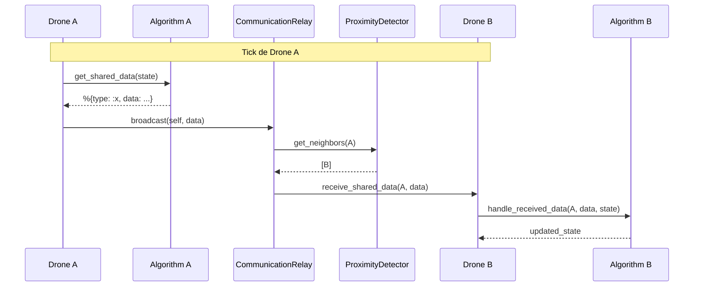
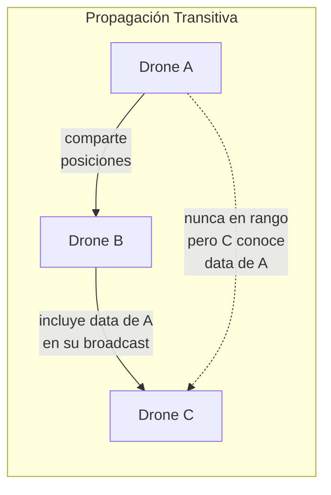

# Sistema de Algoritmos

Los algoritmos son el cerebro de cada dron. Definen cómo se mueve, qué información comparte
con vecinos, y cómo procesa la información que recibe. Cada algoritmo es un módulo Elixir
que implementa la behaviour `Simulator.Algorithm`.

## Behaviour y Callbacks

### `compute_step(state)` — obligatorio

Computa el siguiente paso del dron. Recibe el estado completo del agente y retorna
`{new_position, updated_state}`.

**Estado de entrada (`state`):**
- `state.position` — posición actual `%{x, y}`
- `state.map` — `%Simulator.Maps.MapParams{width, height, structures}`
- `state.neighbors` — `%{pid => %{x, y}}` drones detectados en rango
- `state.id` — identificador numérico del dron
- Cualquier key adicional que el algoritmo haya agregado en ticks anteriores

**Retorno:**
- `new_position` — `%{x: integer(), y: integer()}`
- `updated_state` — estado del agente con keys internas del algoritmo actualizadas

### `get_shared_data(state)` — opcional

Define qué información el dron comparte con sus vecinos en cada tick. El dato se envía
al `CommunicationRelay`, que lo entrega solo a drones dentro del radio de detección.

- Retorna un `map()` con los datos a compartir
- Default: `%{}` (no comparte nada)

### `handle_received_data(sender, data, state)` — opcional

Procesa datos recibidos de un dron vecino. Llamado por el agente cuando el
`CommunicationRelay` le entrega un mensaje.

- `sender` — PID del dron emisor
- `data` — el mapa retornado por `get_shared_data/1` del emisor
- `state` — estado actual del agente
- Retorna el estado actualizado
- Default: estado sin cambios

### `format_state(algo_state)` — opcional

Prepara el estado del algoritmo para consumo externo (panel de detalle del dron).
Debe retornar un mapa estructurado con dos keys:

- `:detail_fields` — lista de campos a mostrar, cada uno con `:label`, `:value`, y `:type`
- `:overlay` — `nil` o mapa con `:cells` (lista de `%{x, y, intensity}`) y `:color` (string RGB)

**Tipos de campo soportados:**

| Tipo | Renderizado en frontend |
|------|------------------------|
| `"text"` | Valor como string plano |
| `"position"` | `(x, y)` desde un mapa `%{x, y}` |
| `"badge"` | Badge/tag estilizado |
| `"boolean"` | "Yes" / "No" |

**Ejemplo:**

```elixir
@impl true
def format_state(algo_state) do
  %{
    detail_fields: [
      %{label: "Target", value: %{x: 120, y: 340}, type: "position"},
      %{label: "Role", value: "alpha", type: "badge"},
      %{label: "Visited Cells", value: 142, type: "text"},
      %{label: "Objective Found", value: true, type: "boolean"}
    ],
    overlay: %{
      cells: [%{x: 0, y: 0, intensity: 0.5}],
      color: "239, 68, 68"
    }
  }
end
```

- `algo_state` — estado del algoritmo (sin keys del sistema como `:position`, `:neighbors`, etc.)
- Default: `%{detail_fields: [], overlay: nil}` (panel muestra solo posición y vecinos)

## Reglas de Estado

Los algoritmos persisten estado entre ticks agregando keys al mapa de estado del agente.
En cada llamada a `compute_step/1`, el algoritmo recibe su estado anterior y retorna el
actualizado. Reglas importantes:

1. **No modificar keys del sistema** — `:position`, `:map`, `:neighbors`, `:id`, `:algorithm`
   son gestionadas por `PointAgent`. El algoritmo solo lee estas keys.
2. **Retornar siempre el estado** — incluso si no cambió, devolver `state` en la tupla.
3. **Keys propias** — cada algoritmo usa sus propias keys (e.g., `:target`, `:velocity`,
   `:pheromone_grid`). No hay conflicto entre algoritmos porque solo uno corre por agente.
4. **Inicialización lazy** — usar `Map.get(state, :key) || valor_inicial` para inicializar
   estado en el primer tick, sin necesidad de un init separado.

## Sistema de Comunicación





La comunicación entre drones es descentralizada y de alcance limitado:

1. **Broadcast** — en cada tick, `PointAgent` llama `get_shared_data(state)` del algoritmo
   y envía el resultado al `CommunicationRelay`.
2. **Entrega** — el `CommunicationRelay` consulta al `ProximityDetector` para obtener los
   vecinos del emisor y entrega el mensaje solo a drones dentro del radio de detección.
3. **Recepción** — cuando un dron recibe un mensaje, `PointAgent` llama
   `handle_received_data(sender, data, state)` del algoritmo para actualizar el estado.

La información se propaga transitivamente: si A comparte con B, y B incluye los datos
de A en su propio broadcast, C puede recibir información de A a través de B sin haber
estado nunca en su rango.

### Patrones de comunicación

| Patrón | Ejemplo | Merge |
|--------|---------|-------|
| Broadcast de posición | PSO, GWO | Almacenar última posición conocida |
| Conocimiento por fuente | HeatmapWalk | `KnowledgeStore` — merge por PID original, decay por tick |
| Grid compartido | AntColony | `max` por celda — idempotente, sin eco |
| Evento único | PSO objetivo encontrado | Guardar una vez, ignorar duplicados |

## Invocación desde PointAgent

`PointAgent` es un GenServer que ejecuta el ciclo cada tick (~30ms):

1. `algorithm.compute_step(state)` → actualiza posición y estado
2. `Algorithm.shared_data(algorithm, state)` → obtiene datos a compartir
3. Envía datos al `CommunicationRelay`
4. Al recibir mensajes: `Algorithm.receive_data(algorithm, sender, data, state)`

Los helpers en `Simulator.Algorithm` (`shared_data/2`, `receive_data/4`, `format_state/2`)
verifican si el callback está implementado antes de llamarlo, usando `function_exported?/3`.

## Registro de Algoritmos

Los algoritmos se registran en `Simulator.Algorithms` (`lib/simulator/algorithms/algorithms.ex`):

```elixir
@available_algorithms %{
  "aim_random_walk" => AimRandomWalk,
  "ant_colony" => AntColony,
  "grey_wolf" => GreyWolf,
  "heatmap_walk" => HeatmapWalk,
  "particle_swarm" => ParticleSwarm,
  "random_walk" => RandomWalk,
  "static" => Static
}
```

- `get_algorithm/1` acepta strings (busca en el registry) o módulos atom (los devuelve directamente)
- Si el string no se encuentra, se usa `RandomWalk` por defecto

## Implementar un Nuevo Algoritmo

### Algoritmo básico (solo movimiento)

1. Crear módulo en `lib/simulator/algorithms/impl/`:

```elixir
defmodule Simulator.Algorithms.MiAlgoritmo do
  @moduledoc "Descripción del algoritmo."
  @behaviour Simulator.Algorithm

  alias Simulator.Algorithms.Helpers.Geometry

  @impl true
  def compute_step(%{position: position, map: map} = state) do
    # Calcular nueva posición
    new_position = %{x: ..., y: ...}
    {new_position, state}
  end
end
```

2. Registrar en `@available_algorithms` en `lib/simulator/algorithms/algorithms.ex`

### Algoritmo con estado interno

Para persistir estado entre ticks (target, velocidad, datos acumulados):

```elixir
@impl true
def compute_step(%{position: position, map: map} = state) do
  target = Map.get(state, :target) || generar_target(map)
  # ... lógica de movimiento
  {new_position, Map.put(state, :target, new_target)}
end
```

### Algoritmo con comunicación

Para compartir información entre drones:

```elixir
@impl true
def get_shared_data(state) do
  %{type: :mi_tipo, dato: Map.get(state, :dato)}
end

@impl true
def handle_received_data(_sender, %{type: :mi_tipo, dato: dato}, state) do
  # Procesar dato recibido
  Map.put(state, :datos_recibidos, dato)
end

def handle_received_data(_sender, _data, state), do: state
```

### Algoritmo con KnowledgeStore

Para compartir conocimiento posicional con decay y anti-eco:

```elixir
alias Simulator.Algorithms.Helpers.KnowledgeStore

@impl true
def get_shared_data(state) do
  visited = Map.get(state, :visited, [])
  received = Map.get(state, :received_visited, %{})
  %{type: :mi_tipo, knowledge: KnowledgeStore.build_shareable(visited, received)}
end

@impl true
def handle_received_data(_sender, %{type: :mi_tipo, knowledge: incoming}, state) do
  received = Map.get(state, :received_visited, %{})
  Map.put(state, :received_visited, KnowledgeStore.merge(received, incoming))
end

@impl true
def format_state(algo_state) do
  own = Map.get(algo_state, :visited, [])
  received = Map.get(algo_state, :received_visited, %{})
  all = KnowledgeStore.all_positions(own, received)

  %{
    detail_fields: [%{label: "Visited Cells", value: length(all), type: "text"}],
    overlay: nil
  }
end
```

## Utilidades Disponibles

Los helpers en `lib/simulator/algorithms/helpers/` proveen funcionalidades reutilizables:

- **[Geometry](helpers/geometry.md)** — primitivas geométricas, detección de colisiones,
  generación de puntos, grillas de celdas
- **[KnowledgeStore](helpers/knowledge_store.md)** — gestión de conocimiento compartido
  con decay, merge anti-eco, y exportación

## Implementaciones

| Algoritmo | Comunicación | Estado interno | Documentación |
|-----------|:------------:|:--------------:|:-------------:|
| [Static](implementations/static.md) | No | No | Detalle |
| [RandomWalk](implementations/random_walk.md) | No | No | Detalle |
| [AimRandomWalk](implementations/aim_random_walk.md) | No | target | Detalle |
| [HeatmapWalk](implementations/heatmap_walk.md) | KnowledgeStore | visited, target | Detalle |
| [AntColony](implementations/ant_colony.md) | Grid feromonas | pheromone_grid, target | Detalle |
| [ParticleSwarm](implementations/particle_swarm.md) | Evento objetivo | velocity, personal_best | Detalle |
| [GreyWolf](implementations/grey_wolf.md) | Roles + objetivo | role, known_leaders, target | Detalle |
