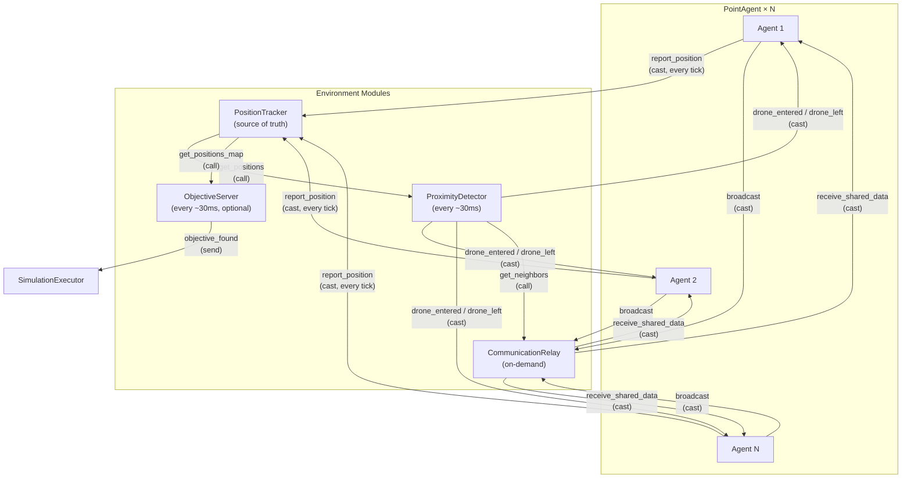
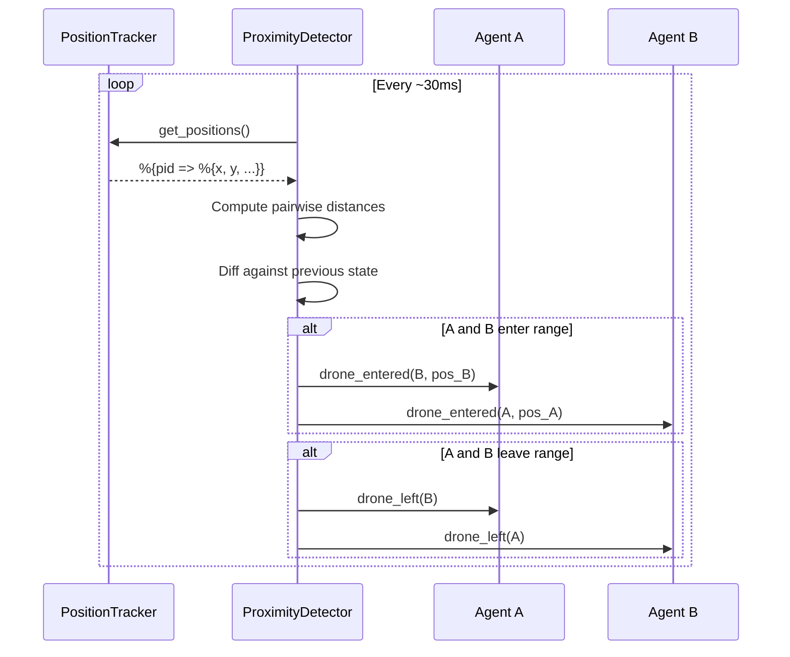
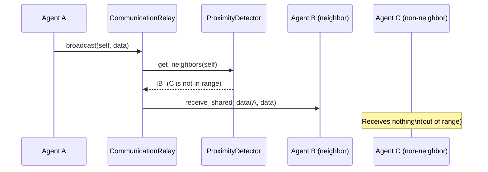
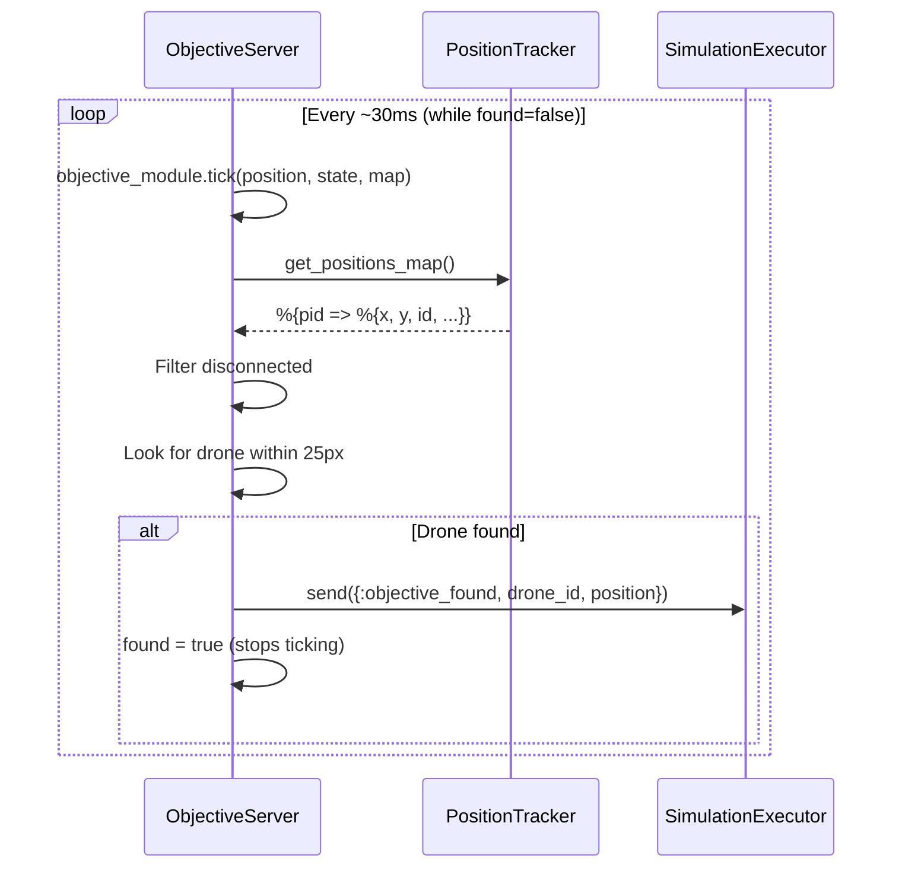

# Environment Modules

**Directory:** `lib/simulator/environment/`

The environment modules are GenServers that simulate aspects of the physical world.
They are started and managed by the SimulationExecutor. Each one handles an aspect
of reality that drones cannot simulate by themselves.

## Interaction Diagram



## Proximity Detection Flow



## Communication Flow



---

## PositionTracker

**Module:** `Simulator.Environment.PositionTracker`
**File:** `lib/simulator/environment/position_tracker.ex`

Stores the positions broadcast by agents. Serves position data to the visualization
layer and to other environment modules.

### State
```elixir
%{
  positions: %{pid => %{x, y, color, id}},
  blocked: MapSet.t(pid)    # PIDs of disconnected agents
}
```

### API

| Function | Description |
|----------|-------------|
| `start_link(opts)` | Starts the tracker |
| `report_position(tracker, pid, position)` | Agent reports its position (cast). Ignored if the agent is blocked |
| `get_positions(tracker)` | Returns all positions (call) |
| `block_agent(tracker, pid)` | Blocks an agent — ignores its `report_position` and marks it with `disconnected: true` (cast) |
| `unblock_agent(tracker, pid)` | Unblocks an agent — resumes `report_position` and clears the `disconnected` flag (cast) |

### Flow
```
PointAgent ──report_position──► PositionTracker ──get_positions──► SimulationExecutor
                                                ──get_positions──► ProximityDetector
```

Agents report their position on every tick. The tracker is the **source of truth**
for the positions of all agents.

---

## ProximityDetector

**Module:** `Simulator.Environment.ProximityDetector`
**File:** `lib/simulator/environment/proximity_detector.ex`

Every `@check_interval` ms (configurable via `Application.compile_env(:simulator, :tick_interval, 30)`),
it reads all positions from the PositionTracker, filters out disconnected agents
(`disconnected: true`), computes pairwise distances among the active ones, and
detects when drones enter or leave another's detection radius. Disconnected drones
are automatically excluded from neighbor calculations.

### State
```elixir
%{
  tracker: pid(),
  neighbors: %{pid => MapSet.t(pid)},     # Current neighbors per agent
  detection_radius: number()               # Detection radius (default: 50px)
}
```

### API

| Function | Description |
|----------|-------------|
| `start_link(tracker, opts)` | Starts the detector linked to a tracker |
| `get_neighbors(proximity, agent_pid)` | Returns the neighbor set of an agent (call) |

### Detection

On every tick:
1. Reads positions from the PositionTracker
2. Filters out positions with `disconnected: true`
3. Computes pairwise distances among active agents (O(n²))
4. Compares against the previous neighbor state (diff)
4. Notifies affected agents:
   - `PointAgent.notify_drone_entered(pid, neighbor_pid, position)` — new neighbor
   - `PointAgent.notify_drone_left(pid, neighbor_pid)` — neighbor left

### Configuration

The `detection_radius` is read from `Application.compile_env(:simulator, :detection_radius, 50)`.

---

## CommunicationRelay

**Module:** `Simulator.Environment.CommunicationRelay`
**File:** `lib/simulator/environment/communication_relay.ex`

Receives data broadcasts from agents and delivers them only to valid neighbors
(drones within the detection radius). It simulates the physical limitation that
drones can only communicate by radio with nearby drones, not with the entire swarm.

### API

| Function | Description |
|----------|-------------|
| `start_link(proximity, opts)` | Starts the relay linked to a ProximityDetector |
| `broadcast(relay, sender, data)` | Agent sends data to be distributed to neighbors (cast). Ignored if the sender is blocked |
| `block_agent(relay, pid)` | Blocks an agent — neither sends nor receives broadcasts (cast) |
| `unblock_agent(relay, pid)` | Unblocks an agent — resumes broadcasts (cast) |

### State
```elixir
%{
  proximity: pid(),               # ProximityDetector PID
  blocked: MapSet.t(pid)          # PIDs of disconnected agents
}
```

The relay **never inspects nor modifies** the data contents — it only handles
proximity-based routing. The meaning of the data is the algorithm's exclusive
responsibility. Blocked agents are filtered out as both senders and receivers.

---

## ObjectiveServer

**Module:** `Simulator.Environment.ObjectiveServer`
**File:** `lib/simulator/environment/objective_server.ex`

GenServer that manages an objective entity within the simulation. It is **optional** —
only started when the simulation has an objective other than `"none"`. It simulates
a physical object in the world that the drones must find.

### State
```elixir
%{
  objective_module: module(),       # Module implementing Simulator.Objective
  map_params: %MapParams{},        # Map parameters
  tracker: pid(),                   # PositionTracker PID
  executor: pid(),                  # SimulationExecutor PID
  position: %{x, y},               # Current objective position
  objective_state: map(),           # Internal objective state (from the behaviour)
  found: boolean()                  # true once a drone has found it
}
```

### API

| Function | Description |
|----------|-------------|
| `start_link(opts)` | Starts the server with `objective_module`, `map_params`, `tracker`, `executor` |
| `get_position(pid)` | Returns the objective's current position (call) |

### Tick Cycle

Every `@tick_interval` ms:

1. **Move objective:** `objective_module.tick(position, state, map_params)` — the objective
   may be static or move according to its behaviour
2. **Read positions:** `PositionTracker.get_positions_map(tracker)` — gets all drone positions
3. **Filter disconnected:** Excludes drones with `disconnected: true`
4. **Detection scan:** Looks for the first drone within `@detection_radius` (25px) using
   `Geometry.euclidean_distance/2`
5. **If found:** `send(executor, {:objective_found, drone_id, position})` — notifies
   the Executor and stops ticking (`found: true`)

### Detection Flow



---

## Registration

All environment modules are registered by `simulation.name` in the Registry,
allowing one per simulation type.
