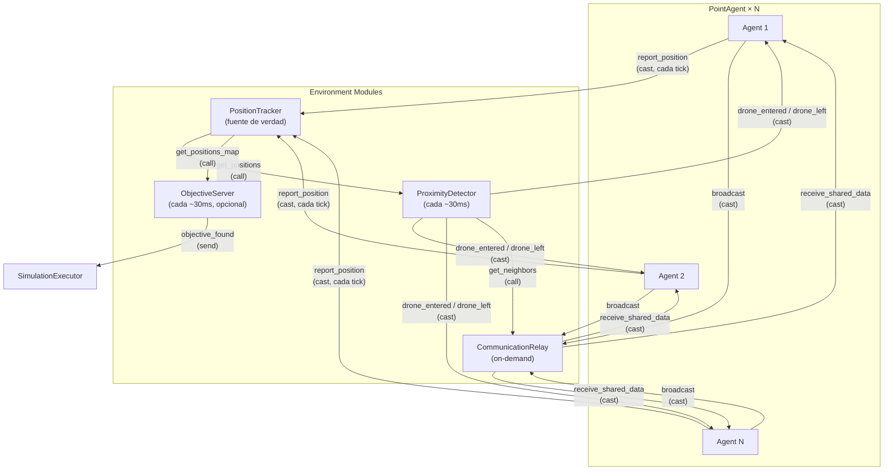
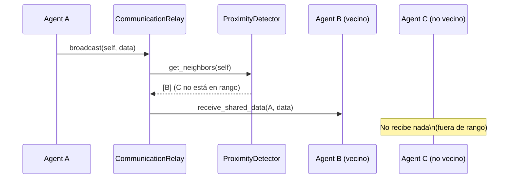
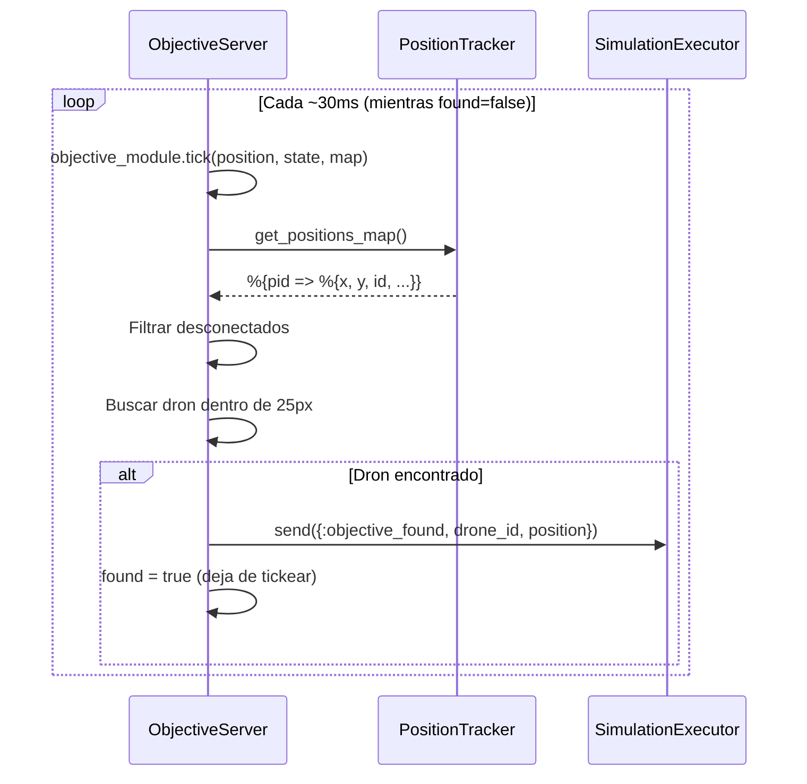

# Environment Modules

**Directorio:** `lib/simulator/environment/`

Los módulos de entorno son GenServers que simulan aspectos del mundo físico. Son iniciados
y gestionados por el SimulationExecutor. Cada uno maneja un aspecto de la realidad que
los drones no pueden simular por sí mismos.

## Diagrama de Interacción



## Flujo de Detección de Proximidad


## Flujo de Comunicación



---

## PositionTracker

**Módulo:** `Simulator.Environment.PositionTracker`
**Archivo:** `lib/simulator/environment/position_tracker.ex`

Almacena las posiciones broadcast por los agentes. Sirve datos de posición a la capa de
visualización y a otros módulos de entorno.

### Estado
```elixir
%{
  positions: %{pid => %{x, y, color, id}},
  blocked: MapSet.t(pid)    # PIDs de agentes desconectados
}
```

### API

| Función | Descripción |
|---------|-------------|
| `start_link(opts)` | Inicia el tracker |
| `report_position(tracker, pid, position)` | Agente reporta su posición (cast). Ignorado si el agente está bloqueado |
| `get_positions(tracker)` | Retorna todas las posiciones (call) |
| `block_agent(tracker, pid)` | Bloquea un agente — ignora sus `report_position` y marca con `disconnected: true` (cast) |
| `unblock_agent(tracker, pid)` | Desbloquea un agente — reanuda `report_position` y elimina flag `disconnected` (cast) |

### Flujo
```
PointAgent ──report_position──► PositionTracker ──get_positions──► SimulationExecutor
                                                ──get_positions──► ProximityDetector
```

Los agentes reportan su posición en cada tick. El tracker es la **fuente de verdad**
de las posiciones de todos los agentes.

---

## ProximityDetector

**Módulo:** `Simulator.Environment.ProximityDetector`
**Archivo:** `lib/simulator/environment/proximity_detector.ex`

Cada `@check_interval` ms (configurable via `Application.compile_env(:simulator, :tick_interval, 30)`),
lee todas las posiciones del PositionTracker, filtra los agentes desconectados (`disconnected: true`),
calcula distancias entre los pares activos, y detecta cuándo drones entran o salen del radio de
detección de otro. Los drones desconectados son excluidos automáticamente del cálculo de vecinos.

### Estado
```elixir
%{
  tracker: pid(),
  neighbors: %{pid => MapSet.t(pid)},     # Vecinos actuales por agente
  detection_radius: number()               # Radio de detección (default: 50px)
}
```

### API

| Función | Descripción |
|---------|-------------|
| `start_link(tracker, opts)` | Inicia el detector vinculado a un tracker |
| `get_neighbors(proximity, agent_pid)` | Retorna el set de vecinos de un agente (call) |

### Detección

En cada tick:
1. Lee posiciones del PositionTracker
2. Filtra posiciones con `disconnected: true`
3. Calcula distancias entre los pares activos (O(n²))
4. Compara con el estado anterior de vecinos (diff)
4. Notifica a los agentes afectados:
   - `PointAgent.notify_drone_entered(pid, neighbor_pid, position)` — nuevo vecino
   - `PointAgent.notify_drone_left(pid, neighbor_pid)` — vecino se fue

### Configuración

El `detection_radius` se lee de `Application.compile_env(:simulator, :detection_radius, 50)`.

---

## CommunicationRelay

**Módulo:** `Simulator.Environment.CommunicationRelay`
**Archivo:** `lib/simulator/environment/communication_relay.ex`

Recibe broadcasts de datos de los agentes y los entrega solo a vecinos válidos (drones
dentro del rango de detección). Simula la limitación física de que los drones solo
pueden comunicarse por radio con drones cercanos, no con todo el enjambre.

### API

| Función | Descripción |
|---------|-------------|
| `start_link(proximity, opts)` | Inicia el relay vinculado a un ProximityDetector |
| `broadcast(relay, sender, data)` | Agente envía datos para distribuir a vecinos (cast). Ignorado si el emisor está bloqueado |
| `block_agent(relay, pid)` | Bloquea un agente — no envía ni recibe broadcasts (cast) |
| `unblock_agent(relay, pid)` | Desbloquea un agente — reanuda broadcasts (cast) |

### Estado
```elixir
%{
  proximity: pid(),               # PID del ProximityDetector
  blocked: MapSet.t(pid)          # PIDs de agentes desconectados
}
```

El relay **nunca inspecciona ni modifica** el contenido de los datos — solo maneja el
ruteo basado en proximidad. El significado de los datos es responsabilidad exclusiva
del algoritmo. Los agentes bloqueados son filtrados tanto como emisores como receptores.

---

## ObjectiveServer

**Módulo:** `Simulator.Environment.ObjectiveServer`
**Archivo:** `lib/simulator/environment/objective_server.ex`

GenServer que gestiona una entidad objetivo dentro de la simulación. Es **opcional** — solo
se inicia cuando la simulación tiene un objetivo distinto de `"none"`. Simula un objeto
físico en el mundo que los drones deben encontrar.

### Estado
```elixir
%{
  objective_module: module(),       # Módulo que implementa Simulator.Objective
  map_params: %MapParams{},        # Parámetros del mapa
  tracker: pid(),                   # PID del PositionTracker
  executor: pid(),                  # PID del SimulationExecutor
  position: %{x, y},               # Posición actual del objetivo
  objective_state: map(),           # Estado interno del objetivo (del behaviour)
  found: boolean()                  # true cuando un dron lo encontró
}
```

### API

| Función | Descripción |
|---------|-------------|
| `start_link(opts)` | Inicia el server con `objective_module`, `map_params`, `tracker`, `executor` |
| `get_position(pid)` | Retorna la posición actual del objetivo (call) |

### Ciclo de Tick

Cada `@tick_interval` ms:

1. **Mover objetivo**: `objective_module.tick(position, state, map_params)` — el objetivo
   puede ser estático o moverse según su behaviour
2. **Leer posiciones**: `PositionTracker.get_positions_map(tracker)` — obtiene todas las
   posiciones de los drones
3. **Filtrar desconectados**: Excluye drones con `disconnected: true`
4. **Buscar detección**: Busca el primer dron dentro de `@detection_radius` (25px) usando
   `Geometry.euclidean_distance/2`
5. **Si encuentra**: `send(executor, {:objective_found, drone_id, position})` — notifica
   al Executor y deja de tickear (`found: true`)

### Flujo de Detección



---

## Registro

Todos los environment modules son registrados por `simulation.name` en el Registry,
permitiendo uno por tipo de simulación.
