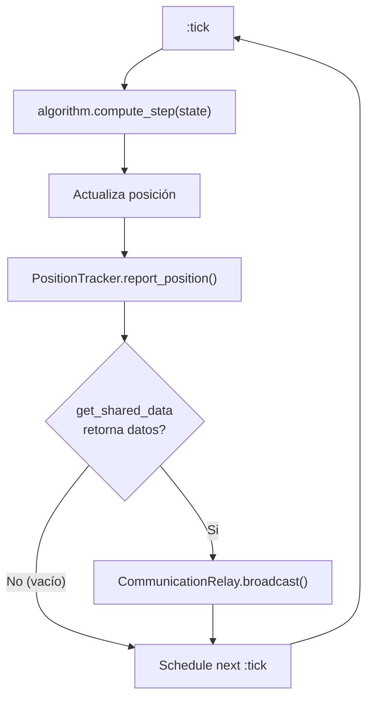
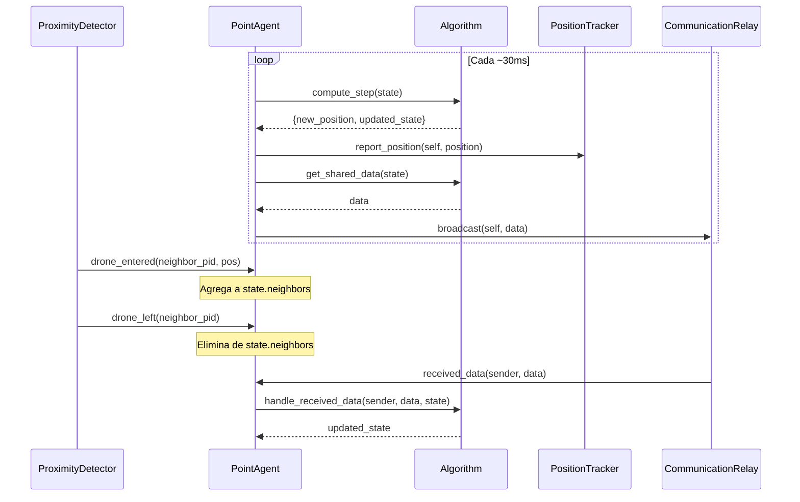

# PointAgent

**Módulo:** `Simulator.PointAgent`
**Archivo:** `lib/simulator/point_agent.ex`

## Descripción

Modela un **dron autónomo** como un proceso GenServer. Cada PointAgent representa un miembro
del enjambre que opera exclusivamente con **información local** — conoce su posición, su mapa
(pre-cargado, como un GPS offline), sus vecinos detectados, y datos recibidos de otros drones.
No accede a estado externo directamente, tal como un dron real estaría limitado a sus propios
sensores y comunicaciones.

## Ciclo de Tick



## Flujo de Mensajes



## Estado

```elixir
%{
  id: integer(),              # Identificador numérico del dron
  position: %{x, y},         # Posición actual
  algorithm: module(),        # Módulo del algoritmo de movimiento
  map: %MapParams{},         # Parámetros del mapa (width, height, structures)
  neighbors: %{pid => %{x, y}},  # Vecinos detectados por el entorno
  tracker: pid(),             # PID del PositionTracker
  relay: pid(),               # PID del CommunicationRelay
  # + keys del algoritmo (e.g., :target, :velocity, :visited, etc.)
}
```

## Posición Inicial

Definida por el `spawn_point` del mapa (e.g., `%{x: 250, y: 250}` para CleanMap).
Todos los agentes de una simulación comparten el mismo punto de spawn.

## Tick Loop

Cada `@update_interval` ms (configurable via `Application.compile_env(:simulator, :tick_interval, 30)`),
el dron ejecuta su ciclo en `handle_info(:tick)`:

1. **Movimiento**: `algorithm.compute_step(state)` → `{new_position, updated_state}`
2. **Reporte de posición**: `PositionTracker.report_position(tracker, self(), position)`
3. **Broadcast de datos**: Si el algoritmo define `get_shared_data/1` y retorna datos no vacíos,
   los envía al `CommunicationRelay.broadcast(relay, self(), data)`
4. **Schedule next tick**: `Process.send_after(self(), :tick, @update_interval)`

## Mensajes Entrantes

### Via `handle_cast`

| Mensaje | Origen | Efecto |
|---------|--------|--------|
| `{:drone_entered, pid, pos}` | ProximityDetector | Agrega vecino a `state.neighbors` |
| `{:drone_left, pid}` | ProximityDetector | Elimina vecino de `state.neighbors` |
| `{:received_data, sender, data}` | CommunicationRelay | Llama `Algorithm.receive_data(algorithm, sender, data, state)` |

### Via `handle_call`

| Mensaje | Origen | Respuesta |
|---------|--------|-----------|
| `:get_position` | SimulationExecutor | `%{x, y}` |
| `:get_detail` | SimulationExecutor | Estado completo formateado por `Algorithm.format_state/2` |

## API Pública

| Función | Descripción |
|---------|-------------|
| `start_link(algorithm, map, tracker, relay, id)` | Inicia el GenServer con el algoritmo y mapa resueltos |
| `get_position(pid)` | Retorna la posición actual del dron |
| `get_detail(pid)` | Retorna el estado detallado (posición + estado del algoritmo formateado) |
| `notify_drone_entered(pid, drone_pid, position)` | Notifica que un dron entró en rango |
| `notify_drone_left(pid, drone_pid)` | Notifica que un dron salió de rango |
| `receive_shared_data(pid, sender, data)` | Entrega datos compartidos de un vecino |

## Inicialización

En `init/1`, el PointAgent:
1. Resuelve el nombre del algoritmo a un módulo via `Simulator.Algorithms.get_algorithm/1`
2. Resuelve el nombre del mapa a parámetros via `Simulator.Maps.get_map/1`
3. Valida que los PIDs del tracker y relay sean procesos vivos
4. Establece la posición inicial en `map.spawn_point`
5. Programa el primer tick

Si el algoritmo o mapa no se reconocen, se loguea un warning y se usan los defaults
(RandomWalk y CleanMap respectivamente).

## Principio de Autonomía

El dron solo puede actuar sobre información que podría tener de forma realista:
- Su posición
- El mapa estático
- Vecinos detectados por el entorno (ProximityDetector)
- Datos compartidos por esos vecinos (via CommunicationRelay)

**No puede** consultar posiciones de otros drones directamente, ni conocer ubicaciones
de objetivos salvo que el entorno se lo comunique explícitamente.
