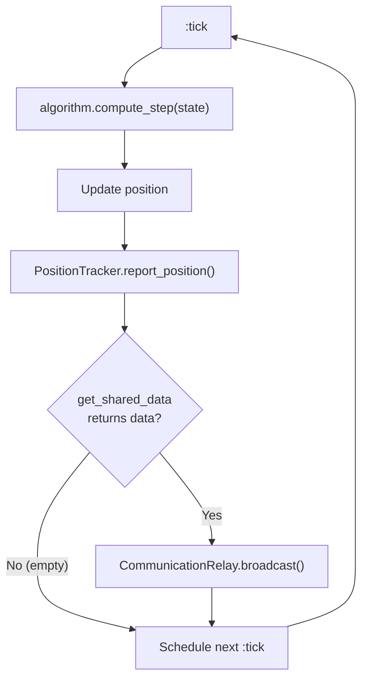

# PointAgent

**Module:** `Simulator.PointAgent`
**File:** `lib/simulator/point_agent.ex`

## Description

Models an **autonomous drone** as a GenServer process. Each PointAgent represents a
swarm member that operates exclusively on **local information** — it knows its
position, its map (preloaded, like an offline GPS), its detected neighbors, and
data received from other drones. It does not access external state directly, just
as a real drone would be limited to its own sensors and communications.

## Tick Cycle



## Message Flow


## State

```elixir
%{
  id: integer(),              # Numeric drone identifier
  position: %{x, y},         # Current position
  algorithm: module(),        # Movement algorithm module
  map: %MapParams{},         # Map parameters (width, height, structures)
  neighbors: %{pid => %{x, y}},  # Neighbors detected by the environment
  tracker: pid(),             # PositionTracker PID
  relay: pid(),               # CommunicationRelay PID
  # + algorithm keys (e.g., :target, :velocity, :visited, etc.)
}
```

## Initial Position

Defined by the map's `spawn_point` (e.g., `%{x: 250, y: 250}` for CleanMap).
All agents in a simulation share the same spawn point.

## Tick Loop

Every `@update_interval` ms (configurable via `Application.compile_env(:simulator, :tick_interval, 30)`),
the drone runs its cycle in `handle_info(:tick)`:

1. **Movement:** `algorithm.compute_step(state)` → `{new_position, updated_state}`
2. **Position report:** `PositionTracker.report_position(tracker, self(), position)`
3. **Data broadcast:** If the algorithm defines `get_shared_data/1` and returns non-empty data,
   sends it to `CommunicationRelay.broadcast(relay, self(), data)`
4. **Schedule next tick:** `Process.send_after(self(), :tick, @update_interval)`

## Incoming Messages

### Via `handle_cast`

| Message | Origin | Effect |
|---------|--------|--------|
| `{:drone_entered, pid, pos}` | ProximityDetector | Adds the neighbor to `state.neighbors` |
| `{:drone_left, pid}` | ProximityDetector | Removes the neighbor from `state.neighbors` |
| `{:received_data, sender, data}` | CommunicationRelay | Calls `Algorithm.receive_data(algorithm, sender, data, state)` |

### Via `handle_call`

| Message | Origin | Response |
|---------|--------|----------|
| `:get_position` | SimulationExecutor | `%{x, y}` |
| `:get_detail` | SimulationExecutor | Full state with `algorithm_state` structured (`%{detail_fields, overlay}`) by `Algorithm.format_state/2` |

## Public API

| Function | Description |
|----------|-------------|
| `start_link(algorithm, map, tracker, relay, id)` | Starts the GenServer with the resolved algorithm and map |
| `get_position(pid)` | Returns the drone's current position |
| `get_detail(pid)` | Returns the detailed state (position + formatted algorithm state) |
| `notify_drone_entered(pid, drone_pid, position)` | Notifies that a drone has entered range |
| `notify_drone_left(pid, drone_pid)` | Notifies that a drone has left range |
| `receive_shared_data(pid, sender, data)` | Delivers shared data from a neighbor |

## Initialization

In `init/1`, the PointAgent:
1. Resolves the algorithm name to a module via `Simulator.Algorithms.get_algorithm/1`
2. Resolves the map name to parameters via `Simulator.Maps.get_map/1`
3. Validates that the tracker and relay PIDs are live processes
4. Sets the initial position to `map.spawn_point`
5. Schedules the first tick

If the algorithm or map is not recognized, a warning is logged and the defaults
are used (RandomWalk and CleanMap, respectively).

## Autonomy Principle

The drone can only act on information it could realistically have:
- Its position
- The static map
- Neighbors detected by the environment (ProximityDetector)
- Data shared by those neighbors (via CommunicationRelay)

It **cannot** query other drones' positions directly, nor know objective locations
unless the environment communicates them explicitly.

**Behavior on disconnection:** When the Executor disconnects a drone via
`toggle_drone_connection`, the environment blocks its communications (PositionTracker
ignores its `report_position`, CommunicationRelay ignores its broadcasts,
ProximityDetector excludes it from neighbor calculations). The PointAgent **receives
no notification** — it keeps running its tick loop with stale state (old neighbors,
outdated algorithm data). Upon reconnection, the ProximityDetector eventually
corrects this by sending `drone_left`/`drone_entered` over the next cycles,
simulating a real reconnection.
