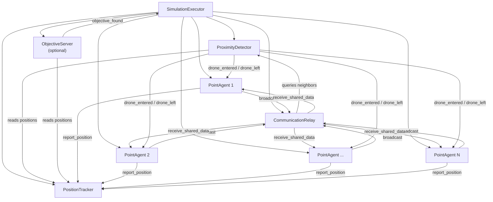
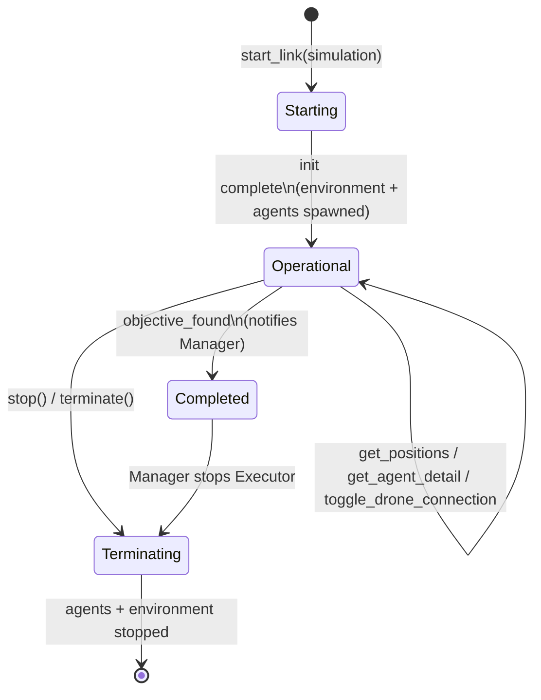
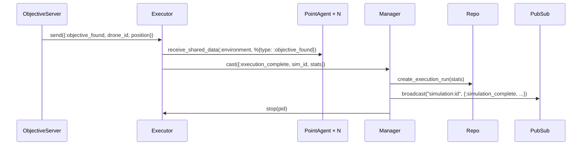

# SimulationExecutor

**Module:** `Simulator.SimulationExecutor`
**File:** `lib/simulator/simulation_executor.ex`

## Description

The Executor is the **environment simulator**, not a drone controller. In a swarm
simulation, all decisions must happen inside each drone (PointAgent) — the
Executor's job is to simulate the physical world around them.

## Process Tree

On initialization, the Executor creates the environment modules and then spawns the agents:

```
SimulationExecutor
  |-- PositionTracker      (stores positions broadcast by agents)
  |-- ProximityDetector    (detects when drones enter/leave range)
  |-- CommunicationRelay   (delivers shared data between neighboring drones)
  |-- ObjectiveServer      (optional: manages the objective and detects when a drone finds it)
  |-- PointAgent x N       (autonomous drone processes)
```

## Process Diagram



## Lifecycle



## State

```elixir
%{
  simulation: %Simulation{},     # Simulation record (from the DB)
  agents: %{id => %{pid: pid(), disconnected: boolean()}},  # Map of ID → {PID, connection state}
  tracker: pid(),                # PositionTracker PID
  proximity: pid(),              # ProximityDetector PID
  relay: pid(),                  # CommunicationRelay PID
  objective_server: pid() | nil, # ObjectiveServer PID (nil if there is no objective)
  start_time: integer(),         # Start timestamp (monotonic ms)
  tick_count: integer()          # Tick counter (incremented on every get_positions)
}
```

## Responsibilities

| Responsibility | Description |
|----------------|-------------|
| **Spawn agents** | Creates N `PointAgent` processes (N = `simulation.swarm`), each with its ID |
| **Orchestrate environment modules** | Starts and wires up PositionTracker, ProximityDetector, CommunicationRelay, and ObjectiveServer (if there is an objective) |
| **Aggregate positions** | `get_positions/1` reads from the PositionTracker and includes the objective's position (if any) |
| **Query agent detail** | `get_agent_detail/2` retrieves an agent's detailed state by ID |
| **Simulate peripherals** | Can send collision warnings, proximity alerts, or sensor data |
| **Manage objectives** | Delegates to the ObjectiveServer. When it receives `{:objective_found, drone_id, position}`, it notifies all drones via `receive_shared_data` and casts `{:execution_complete, stats}` to the Manager |
| **Drone shutdown** | Can terminate specific agents to simulate hardware failure |
| **Toggle drone connection** | `toggle_drone_connection/3` disconnects/reconnects drones by blocking their communications in PositionTracker and CommunicationRelay. The drone keeps running its algorithm without noticing |

## Public API

| Function | Description |
|----------|-------------|
| `start_link(simulation)` | Starts the Executor with a simulation |
| `get_positions(pid)` | Returns all agent positions |
| `get_agent_detail(pid, agent_id)` | Returns an agent's detailed state |
| `toggle_drone_connection(pid, agent_id, connected)` | Disconnects/reconnects a drone from the environment (call) |
| `stop(pid)` | Stops the Executor and all its child processes |

## Lifecycle

1. **Start**: `SimulationManager.start_execution/1` creates the Executor
2. **Operation**: Agents operate independently; the Executor responds to queries and manages drone disconnections
3. **Completion**: If the ObjectiveServer detects a drone within range, it sends `{:objective_found, ...}` to the Executor. The Executor notifies all drones, computes stats, and casts `{:execution_complete, stats}` to the Manager
4. **Termination**: `terminate/2` stops all agents, environment modules, and the ObjectiveServer
5. **Registration**: Registered by `simulation.name` in the Registry (one per simulation type)

## Relationship with other components

```
SimulationManager  ──calls──►  SimulationExecutor  ──starts──►  Environment Modules
                                                    ──spawns──►  PointAgents
ObjectiveServer  ──send──►  SimulationExecutor  ──cast──►  SimulationManager
```

The Executor is never accessed directly by the web layer — all communication
goes through the SimulationManager.

### Completion signal (Objective Found)


