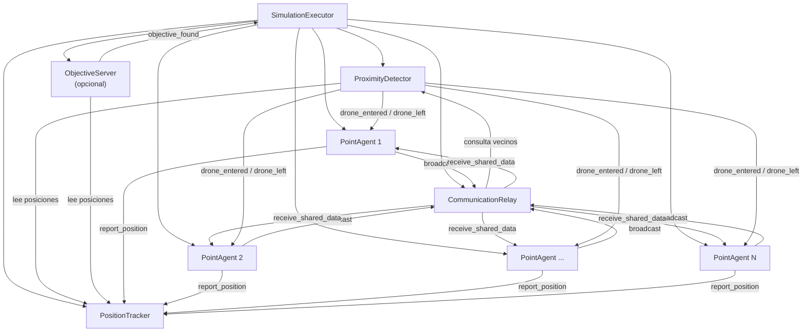
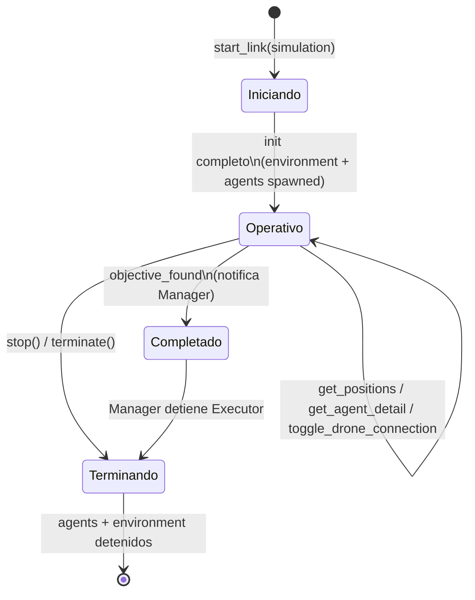
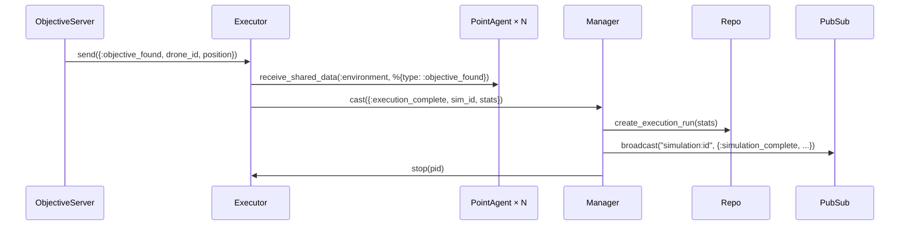

# SimulationExecutor

**Módulo:** `Simulator.SimulationExecutor`
**Archivo:** `lib/simulator/simulation_executor.ex`

## Descripción

El Executor es el **simulador del entorno**, no un controlador de drones. En una simulación
de enjambre, todas las decisiones deben ocurrir dentro de cada dron (PointAgent) — el trabajo
del Executor es simular el mundo físico que los rodea.

## Árbol de Procesos

Al inicializarse, el Executor crea los módulos de entorno y luego spawna los agentes:

```
SimulationExecutor
  |-- PositionTracker      (almacena posiciones broadcast por agentes)
  |-- ProximityDetector    (detecta cuando drones entran/salen del rango)
  |-- CommunicationRelay   (entrega datos compartidos entre drones vecinos)
  |-- ObjectiveServer      (opcional: gestiona el objetivo y detecta cuando un dron lo encuentra)
  |-- PointAgent x N       (procesos de drones autónomos)
```

## Diagrama de Procesos



## Ciclo de Vida



## Estado

```elixir
%{
  simulation: %Simulation{},     # Record de la simulación (de la DB)
  agents: %{id => %{pid: pid(), disconnected: boolean()}},  # Mapa de ID → {PID, estado de conexión}
  tracker: pid(),                # PID del PositionTracker
  proximity: pid(),              # PID del ProximityDetector
  relay: pid(),                  # PID del CommunicationRelay
  objective_server: pid() | nil, # PID del ObjectiveServer (nil si no hay objetivo)
  start_time: integer(),         # Timestamp de inicio (monotonic ms)
  tick_count: integer()          # Contador de ticks (incrementado en cada get_positions)
}
```

## Responsabilidades

| Responsabilidad | Descripción |
|----------------|-------------|
| **Spawn agents** | Crea N procesos `PointAgent` (N = `simulation.swarm`), cada uno con su ID |
| **Orquestar environment modules** | Inicia y cablea PositionTracker, ProximityDetector, CommunicationRelay, y ObjectiveServer (si hay objetivo) |
| **Agregar posiciones** | `get_positions/1` lee del PositionTracker e incluye posición del objetivo (si existe) |
| **Query agent detail** | `get_agent_detail/2` obtiene el estado detallado de un agente por ID |
| **Simular periféricos** | Puede enviar warnings de colisión, alertas de proximidad, o datos de sensores |
| **Gestionar objetivos** | Delega al ObjectiveServer. Cuando recibe `{:objective_found, drone_id, position}`, notifica a todos los drones via `receive_shared_data` y cast `{:execution_complete, stats}` al Manager |
| **Shutdown de drones** | Puede terminar agentes específicos para simular fallas de hardware |
| **Toggle conexión de drones** | `toggle_drone_connection/3` desconecta/reconecta drones bloqueando sus comunicaciones en PositionTracker y CommunicationRelay. El dron sigue ejecutando su algoritmo sin enterarse |

## API Pública

| Función | Descripción |
|---------|-------------|
| `start_link(simulation)` | Inicia el Executor con una simulación |
| `get_positions(pid)` | Retorna todas las posiciones de los agentes |
| `get_agent_detail(pid, agent_id)` | Retorna el estado detallado de un agente |
| `toggle_drone_connection(pid, agent_id, connected)` | Desconecta/reconecta un dron del entorno (call) |
| `stop(pid)` | Detiene el Executor y todos sus procesos hijos |

## Ciclo de Vida

1. **Inicio**: `SimulationManager.start_execution/1` crea el Executor
2. **Operación**: Los agentes operan independientemente, el Executor responde queries y gestiona desconexiones de drones
3. **Completitud**: Si el ObjectiveServer detecta un dron en rango, envía `{:objective_found, ...}` al Executor. El Executor notifica a todos los drones, computa stats, y cast `{:execution_complete, stats}` al Manager
4. **Terminación**: `terminate/2` detiene todos los agentes, environment modules y ObjectiveServer
5. **Registro**: Registrado por `simulation.name` en el Registry (uno por tipo de simulación)

## Relación con otros componentes

```
SimulationManager  ──calls──►  SimulationExecutor  ──starts──►  Environment Modules
                                                    ──spawns──►  PointAgents
ObjectiveServer  ──send──►  SimulationExecutor  ──cast──►  SimulationManager
```

El Executor nunca es accedido directamente por la capa web — toda comunicación
pasa por el SimulationManager.

### Señal de Completitud (Objective Found)


