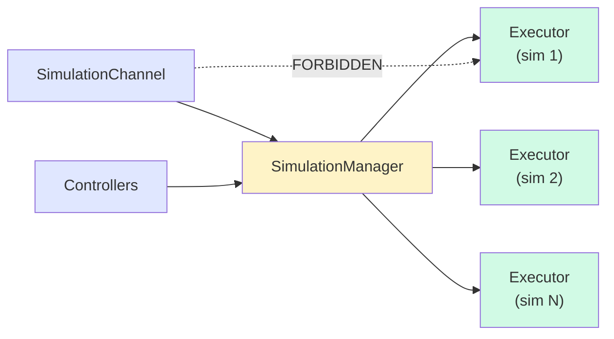
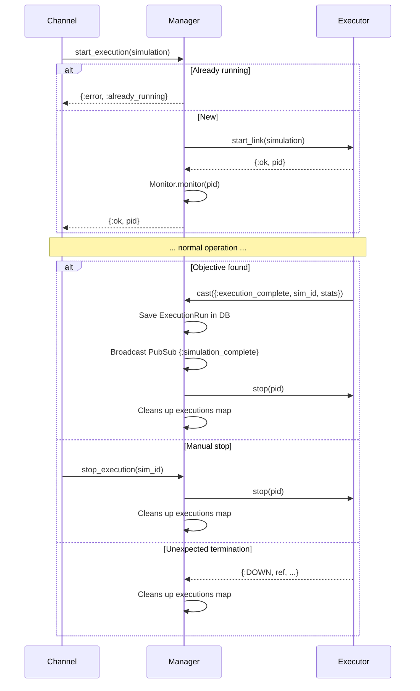

# SimulationManager

**Module:** `Simulator.SimulationManager`
**File:** `lib/simulator/simulation_manager.ex`

## Description

The Manager is an **application-level component**, not part of the simulation itself.
It acts as a centralized bridge between the outside world (controllers, channels)
and the Executors. **No external component should communicate with an Executor
directly** — every interaction must go through the Manager.

## Access Diagram



## Lifecycle



## State

```elixir
%{
  executions: %{simulation_id => executor_pid}
}
```

## Responsibilities

| Responsibility | Description |
|----------------|-------------|
| **Execution tracking** | Maintains the `simulation.id => executor_pid` map |
| **Duplicate prevention** | Returns `:already_running` if the simulation is already executing |
| **Starting executions** | `start_execution/1` creates a SimulationExecutor and monitors it |
| **Stopping executions** | `stop_execution/1` terminates the Executor and frees resources |
| **Execution completion** | `handle_cast({:execution_complete, ...})` saves an `ExecutionRun` in the DB, broadcasts via PubSub, and stops the Executor |
| **Query delegation** | Delegates position queries, agent detail queries, connection toggling, and commands to the appropriate Executor |
| **Monitoring** | `handle_info({:DOWN, ...})` cleans up executions when an Executor terminates unexpectedly |

## Public API

| Function | Description |
|----------|-------------|
| `start_execution(simulation)` | Starts a new execution; returns `{:ok, pid}` or `{:error, :already_running}` |
| `stop_execution(simulation_id)` | Stops an active execution |
| `get_positions(simulation)` | Gets the positions of all agents of a simulation |
| `get_agent_detail(simulation, agent_id)` | Gets the detailed state of an agent |
| `toggle_drone_connection(simulation, agent_id, connected)` | Disconnects/reconnects a drone from the environment |

## Lifecycle

```
Channel.join ──► start_execution ──► creates Executor + Monitor
                                          │
              execution_complete ◄─────────┘  (objective found)
                       │
                       ├── Saves ExecutionRun in DB
                       ├── Broadcasts PubSub {:simulation_complete}
                       └── stop(executor) + cleans up executions map

                        stop_execution ◄───┘  (manual)
                               or
                        {:DOWN, ...}  ◄───┘  (unexpected)
                               │
                        cleans up executions map
```

## Access pattern

```
SimulationChannel ──► SimulationManager ──► SimulationExecutor  (positions, detail, toggle_connection)
SimulationController ──► SimulationManager ──► SimulationExecutor
```

Never:
```
SimulationChannel ──✗──► SimulationExecutor  (forbidden)
```
