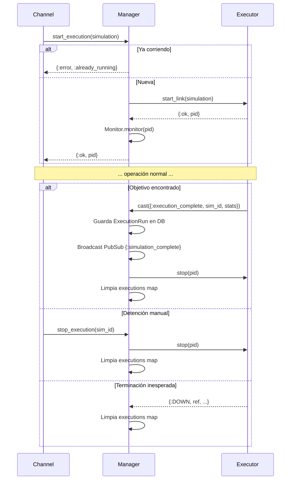

# SimulationManager

**Módulo:** `Simulator.SimulationManager`
**Archivo:** `lib/simulator/simulation_manager.ex`

## Descripción

El Manager es un **componente de nivel aplicación**, no parte de la simulación en sí.
Actúa como bridge centralizado entre el mundo exterior (controllers, channels) y los
Executors. **Ningún componente externo debe comunicarse directamente con un Executor** —
toda interacción debe pasar por el Manager.

## Diagrama de Acceso


## Lifecycle



## Estado

```elixir
%{
  executions: %{simulation_id => executor_pid}
}
```

## Responsabilidades

| Responsabilidad | Descripción |
|----------------|-------------|
| **Tracking de ejecuciones** | Mantiene mapa `simulation.id => executor_pid` |
| **Prevención de duplicados** | Retorna `:already_running` si la simulación ya está en ejecución |
| **Inicio de ejecuciones** | `start_execution/1` crea un SimulationExecutor y lo monitorea |
| **Detención de ejecuciones** | `stop_execution/1` termina el Executor y libera recursos |
| **Completitud de ejecución** | `handle_cast({:execution_complete, ...})` guarda `ExecutionRun` en DB, broadcast via PubSub, y detiene el Executor |
| **Delegación de queries** | Delega position queries, agent detail queries, toggle de conexión, y comandos al Executor apropiado |
| **Monitoreo** | `handle_info({:DOWN, ...})` limpia ejecuciones cuando un Executor termina inesperadamente |

## API Pública

| Función | Descripción |
|---------|-------------|
| `start_execution(simulation)` | Inicia una nueva ejecución, retorna `{:ok, pid}` o `{:error, :already_running}` |
| `stop_execution(simulation_id)` | Detiene una ejecución activa |
| `get_positions(simulation)` | Obtiene posiciones de todos los agentes de una simulación |
| `get_agent_detail(simulation, agent_id)` | Obtiene el estado detallado de un agente |
| `toggle_drone_connection(simulation, agent_id, connected)` | Desconecta/reconecta un dron del entorno |

## Lifecycle

```
Channel.join ──► start_execution ──► crea Executor + Monitor
                                          │
              execution_complete ◄─────────┘  (objetivo encontrado)
                       │
                       ├── Guarda ExecutionRun en DB
                       ├── Broadcast PubSub {:simulation_complete}
                       └── stop(executor) + limpia executions map

                        stop_execution ◄───┘  (manual)
                               o
                        {:DOWN, ...}  ◄───┘  (inesperado)
                               │
                        limpia executions map
```

## Patrón de acceso

```
SimulationChannel ──► SimulationManager ──► SimulationExecutor  (positions, detail, toggle_connection)
SimulationController ──► SimulationManager ──► SimulationExecutor
```

Nunca:
```
SimulationChannel ──✗──► SimulationExecutor  (prohibido)
```
