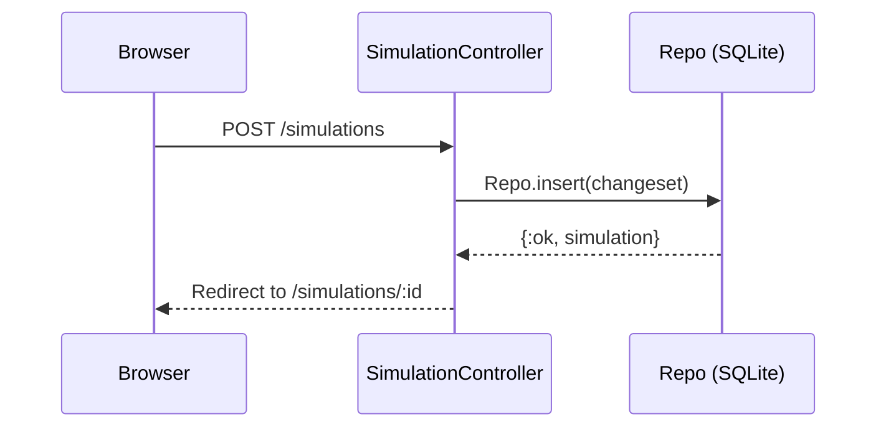
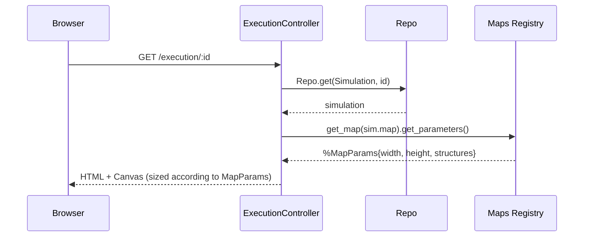
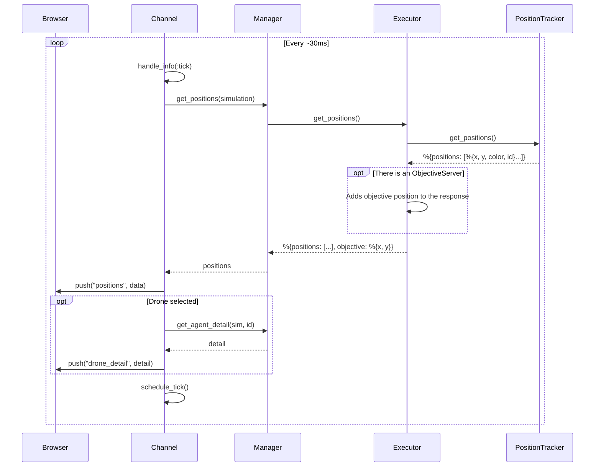
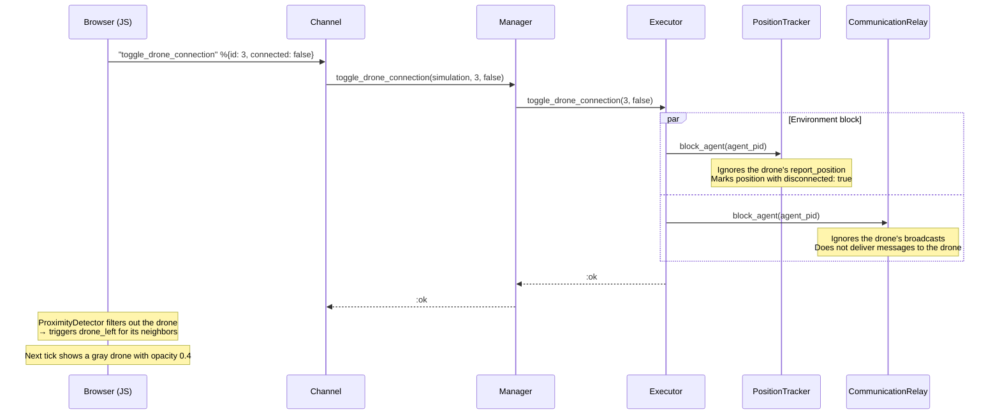
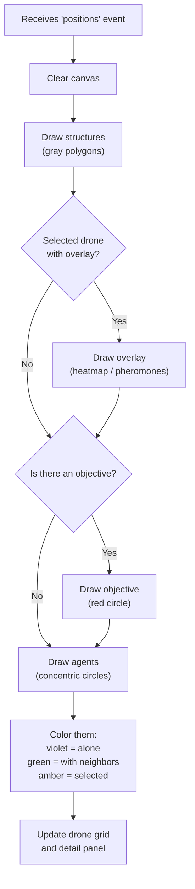
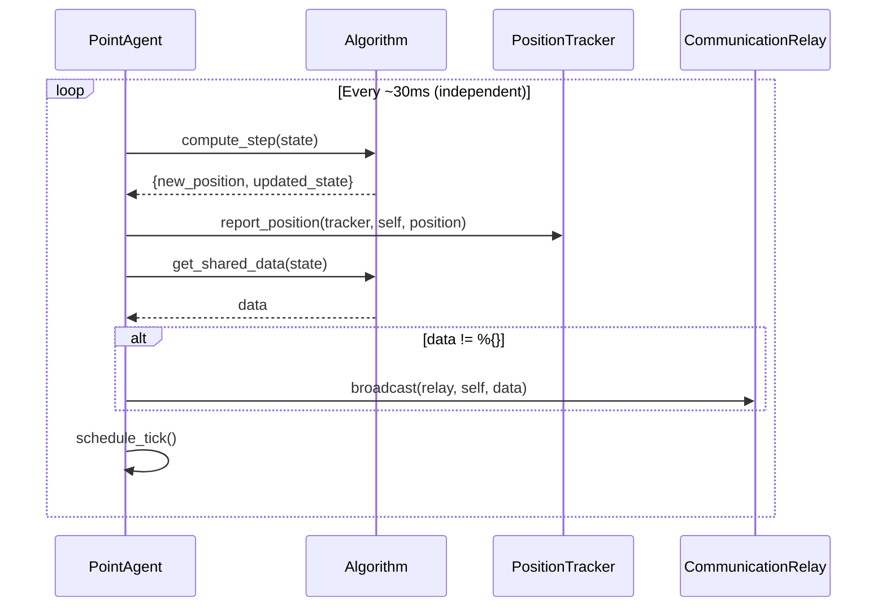
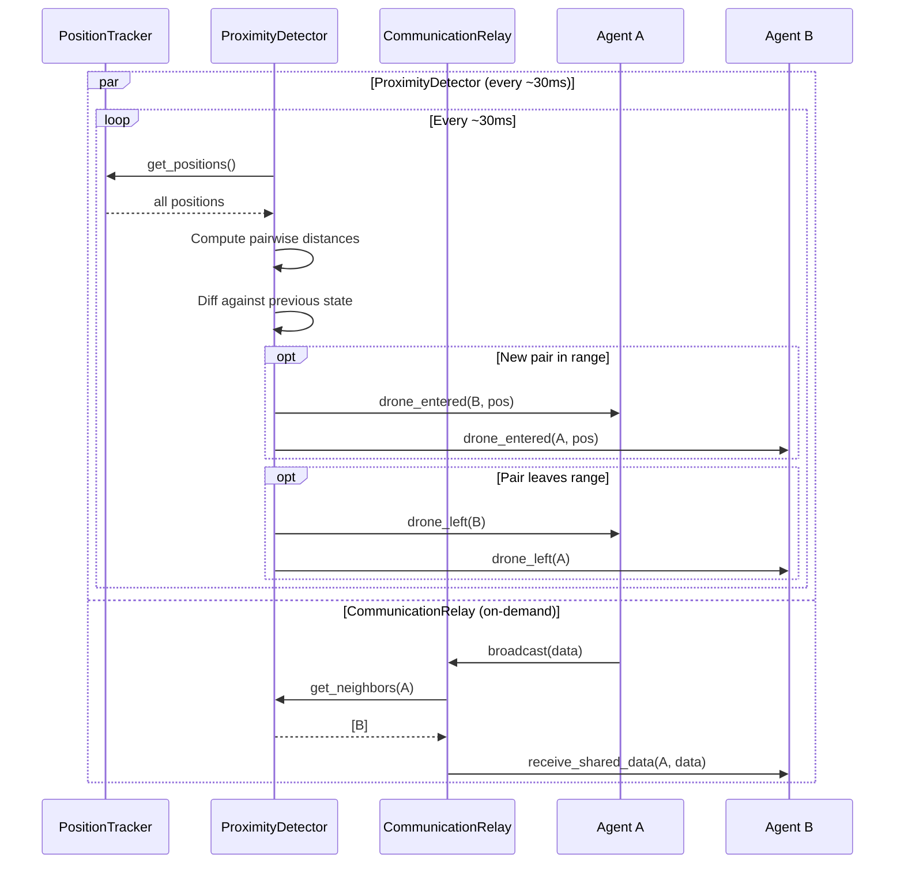
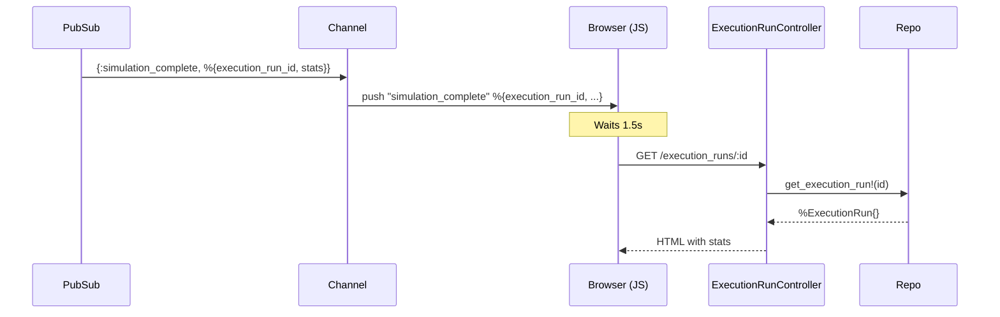

# Data Flows: Real-Time Execution

This document describes the full data flow from when the user creates a simulation
until they see the agents moving on the canvas.

## General Diagram

## Step 1: Simulation creation (CRUD)

The user creates a simulation record with a name, algorithm, agent count, map, and objective.

## Step 2: Execution launch

## Step 3: WebSocket connection

## Step 4: Real-time position loop (every ~30ms)

## Step 4.5: Drone connection toggle (on-demand)

The drone **keeps running** its tick loop — it calls `compute_step`, attempts
`report_position` and `broadcast`, but the environment ignores them. On reconnection
(`connected: true`), the environment resumes tracking and the drone retains its
dirty state (stale neighbors, old data).

## Step 5: Canvas rendering (Browser)

## Step 6: Agent tick cycle (every ~30ms, independent per agent)

## Step 7: Environment modules (continuous, parallel)

> **Note:** Both the ProximityDetector and the CommunicationRelay filter out
> disconnected (blocked) agents from their operations. The ProximityDetector
> excludes positions with `disconnected: true` before computing neighbors, and
> the CommunicationRelay ignores broadcasts to/from blocked agents.

## Step 8: Objective detection (ObjectiveServer, parallel)

> Only applies when the simulation has an objective other than `"none"`.

The stats include: `duration_ms`, `ticks`, `finder_drone_id`, `objective_position`,
`algorithm`, `map`, `objective`, `swarm_size`, `status`.

## Step 9: Redirect to stats screen

The frontend displays: algorithm, map, objective, duration, ticks, finder drone,
objective position, and a button to re-run the simulation.
