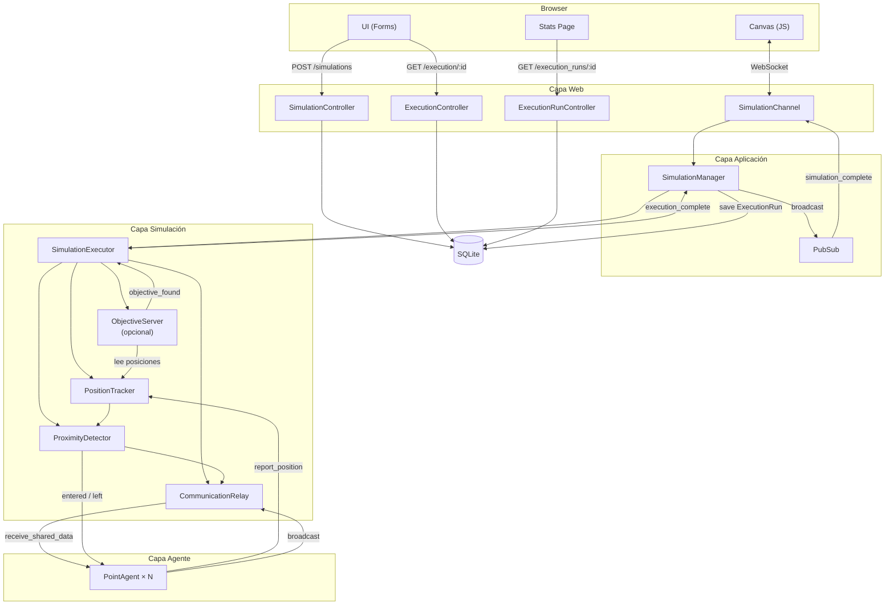
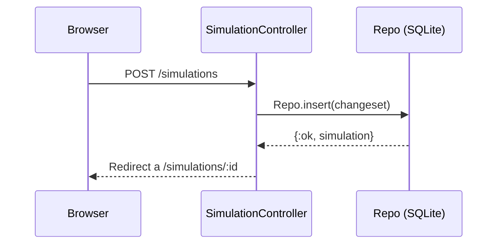
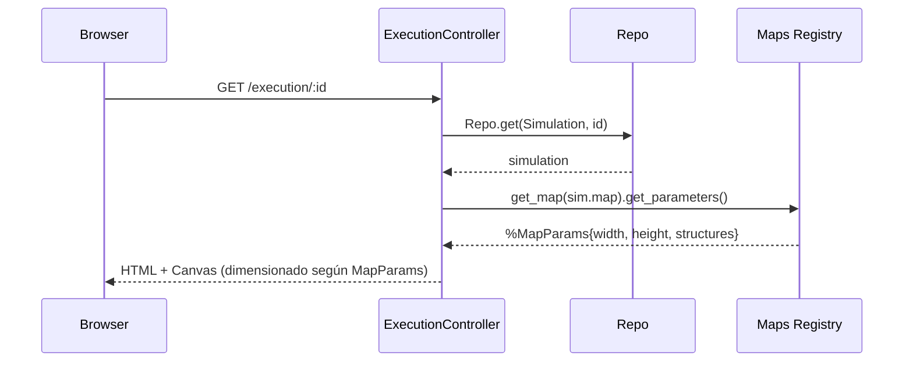
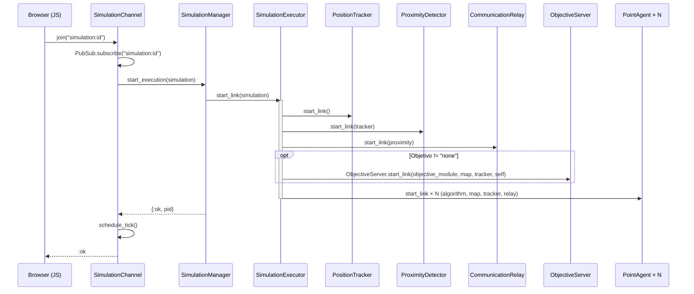
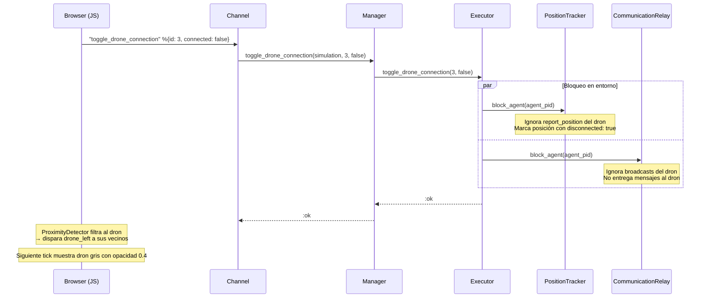
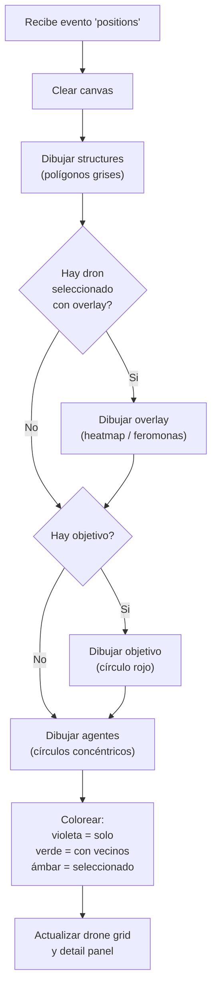
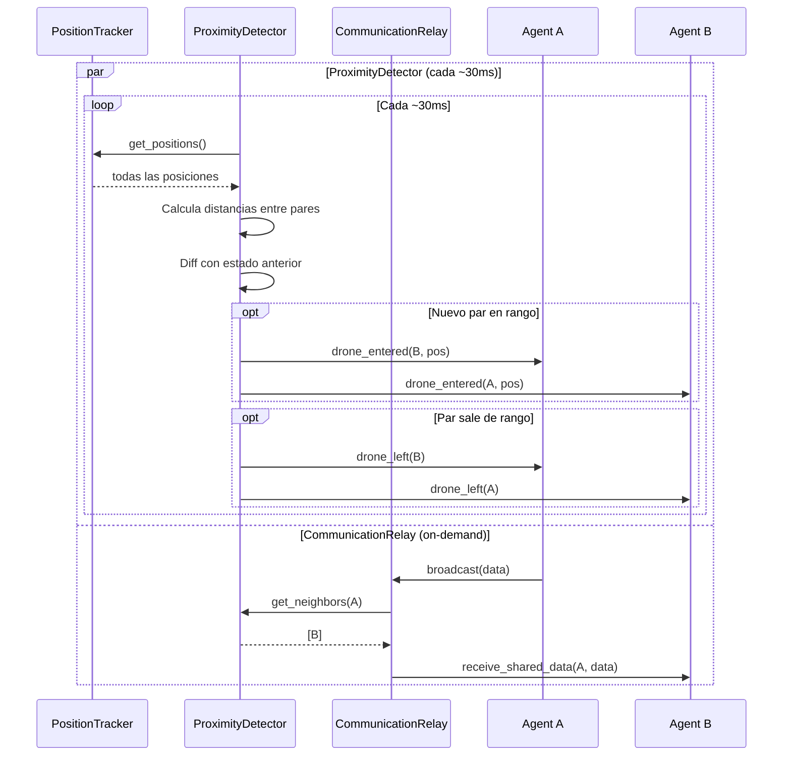
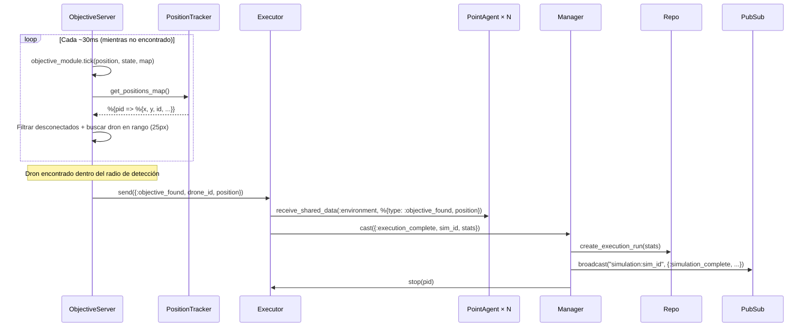
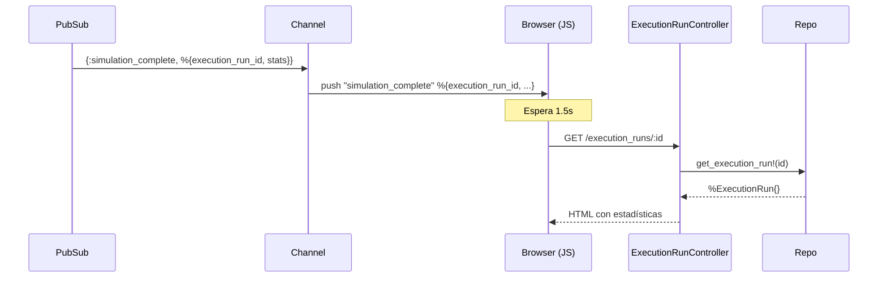

# Data Flows: Ejecución en Tiempo Real

Este documento describe el flujo completo de datos desde que el usuario crea una simulación
hasta que ve los agentes moviéndose en el canvas.

## Diagrama General

## Paso 1: Creación de simulación (CRUD)

El usuario crea un record de simulación con nombre, algoritmo, cantidad de agentes, mapa y objetivo.

## Paso 2: Lanzamiento de ejecución

## Paso 3: Conexión WebSocket

## Paso 4: Loop de posiciones en tiempo real (cada ~30ms)

## Paso 4.5: Toggle de conexión de dron (on-demand)

El dron **sigue corriendo** su tick loop — llama `compute_step`, intenta `report_position`
y `broadcast`, pero el entorno los ignora. Al reconectar (`connected: true`), el entorno
reanuda el tracking y el dron conserva su estado sucio (vecinos obsoletos, datos antiguos).

## Paso 5: Renderizado en Canvas (Browser)

## Paso 6: Ciclo de tick del agente (cada ~30ms, independiente por agente)

## Paso 7: Módulos de entorno (continuo, paralelo)

> **Nota:** Tanto el ProximityDetector como el CommunicationRelay filtran agentes
> desconectados (bloqueados) de sus operaciones. El ProximityDetector excluye posiciones
> con `disconnected: true` antes de calcular vecinos, y el CommunicationRelay ignora
> broadcasts de/hacia agentes bloqueados.

## Paso 8: Detección de objetivo (ObjectiveServer, paralelo)

> Solo aplica cuando la simulación tiene un objetivo distinto de `"none"`.

Las estadísticas incluyen: `duration_ms`, `ticks`, `finder_drone_id`, `objective_position`,
`algorithm`, `map`, `objective`, `swarm_size`, `status`.

## Paso 9: Redirección a pantalla de estadísticas

El frontend muestra: algoritmo, mapa, objetivo, duración, ticks, dron finder,
posición del objetivo, y un botón para volver a ejecutar la simulación.
