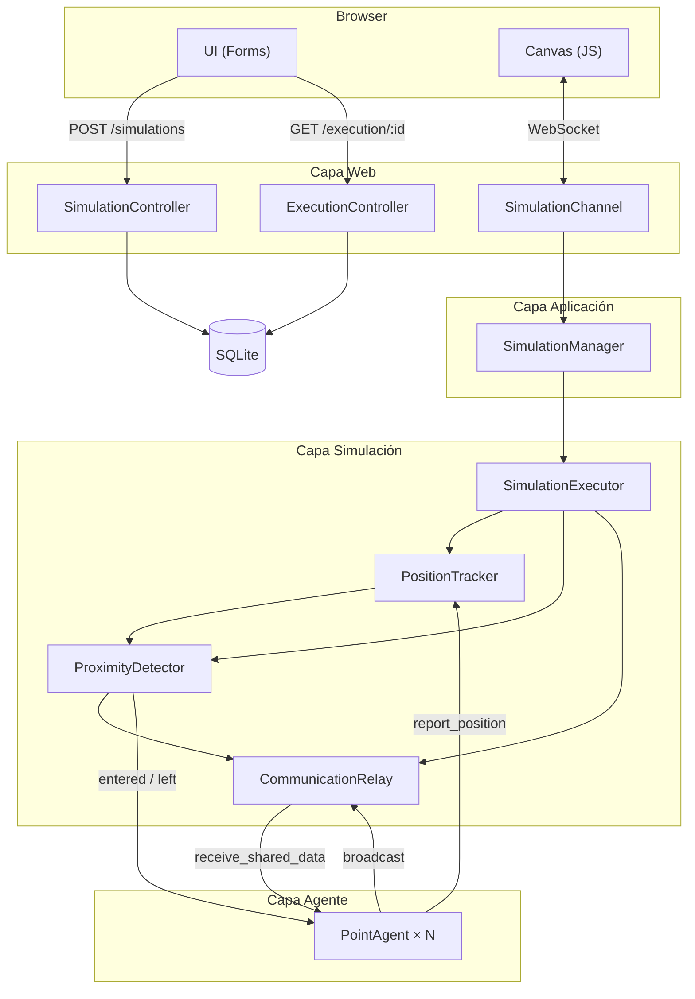
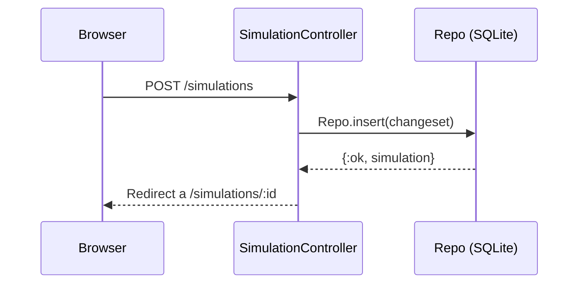
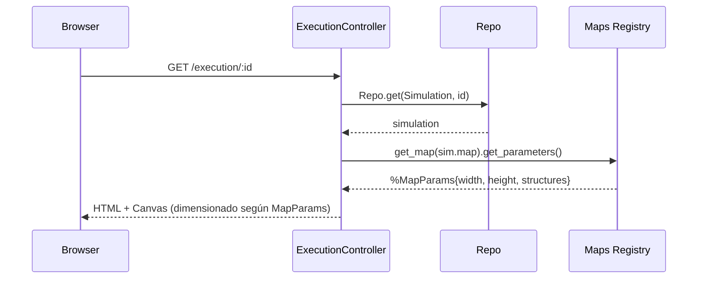
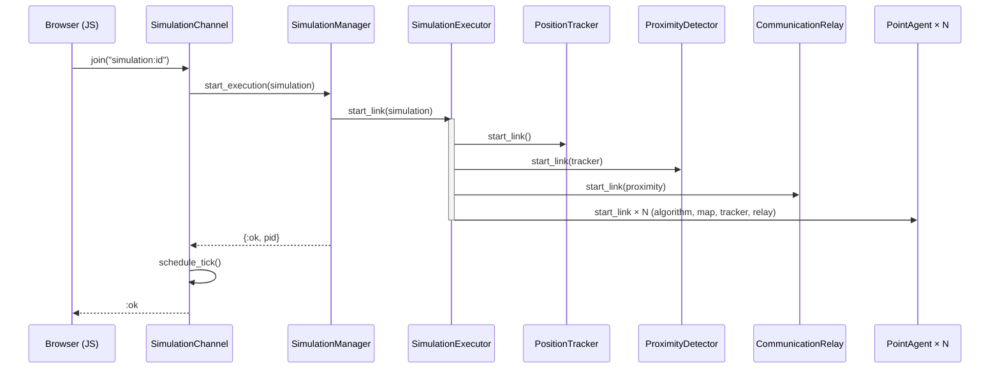
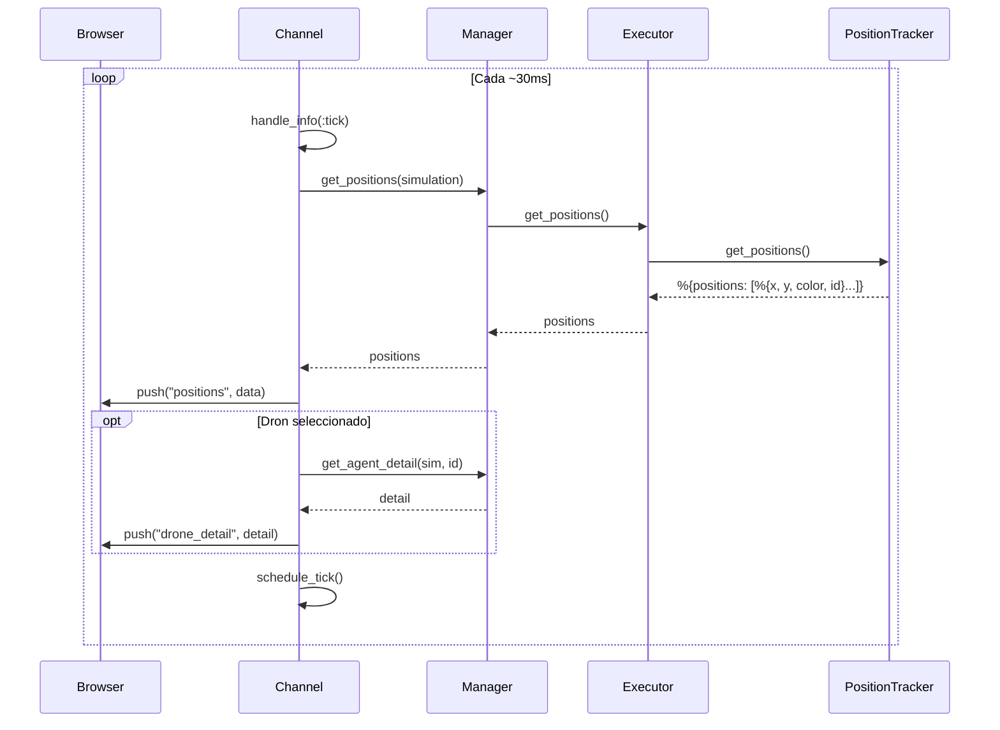
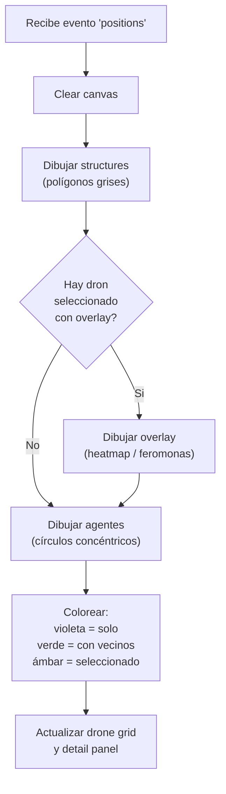
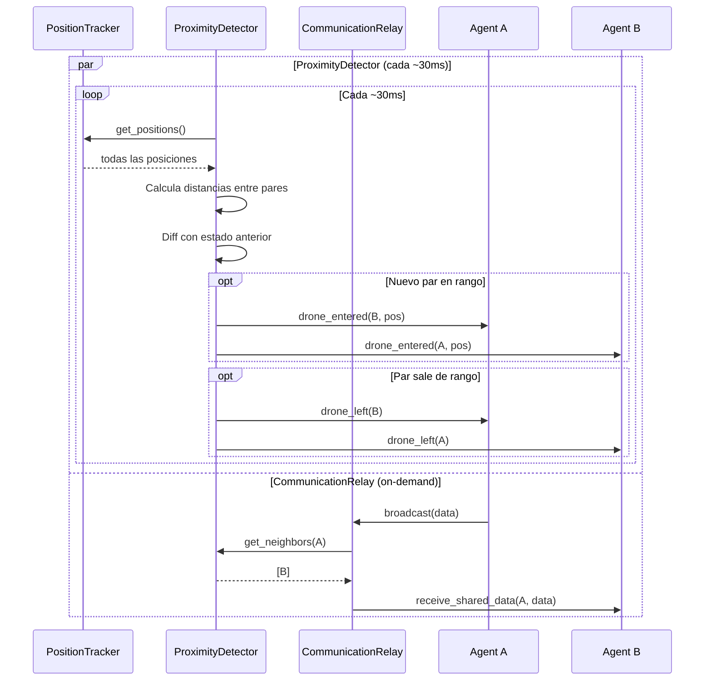

# Data Flows: Ejecución en Tiempo Real

Este documento describe el flujo completo de datos desde que el usuario crea una simulación
hasta que ve los agentes moviéndose en el canvas.

## Diagrama General

## Paso 1: Creación de simulación (CRUD)

El usuario crea un record de simulación con tipo, algoritmo, cantidad de agentes y mapa.

## Paso 2: Lanzamiento de ejecución

## Paso 3: Conexión WebSocket

## Paso 4: Loop de posiciones en tiempo real (cada ~30ms)

## Paso 5: Renderizado en Canvas (Browser)

## Paso 6: Ciclo de tick del agente (cada ~30ms, independiente por agente)

## Paso 7: Módulos de entorno (continuo, paralelo)

