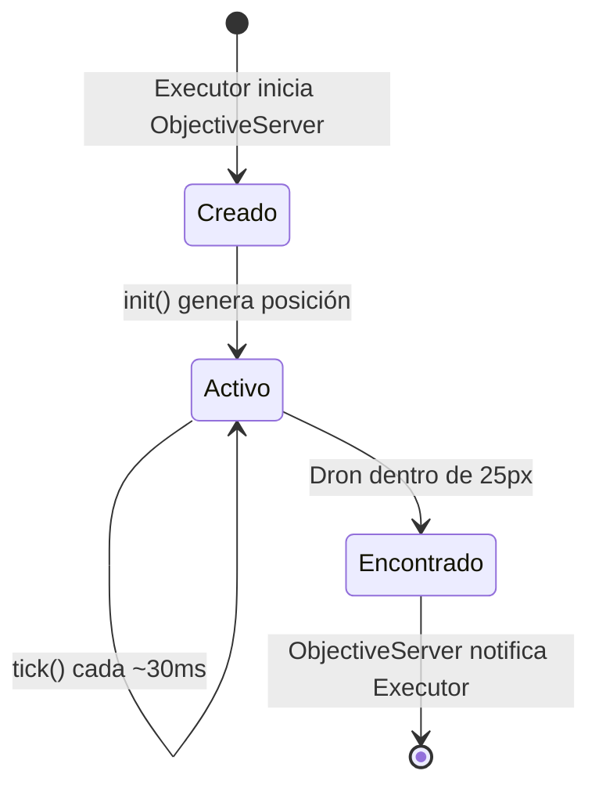

# Sistema de Objetivos

Los objetivos son entidades físicas dentro del mundo simulado que los drones deben encontrar.
Tienen comportamientos pluggables — pueden ser estáticos o moverse según un patrón. Cada
objetivo es un módulo Elixir que implementa la behaviour `Simulator.Objective`.

## Behaviour y Callbacks

### `init(map_params)` — obligatorio

Genera la posición inicial y el estado interno del objetivo.

**Entrada:**
- `map_params` — `%Simulator.Maps.MapParams{width, height, structures}`

**Retorno:**
- `{position, state}` — posición `%{x, y}` y estado interno `map()`

### `tick(position, state, map_params)` — obligatorio

Avanza el objetivo un tick. Los objetivos estáticos retornan la posición sin cambios.
Los objetivos móviles computan su nueva posición.

**Retorno:**
- `{new_position, new_state}`

## Registro de Objetivos

Los objetivos se registran en `Simulator.Objectives` (`lib/simulator/objectives/objectives.ex`):

```elixir
@available_objectives %{
  "static" => StaticObjective,
  "aim_random_walk" => AimRandomWalkObjective
}
```

- `get_objective("none")` retorna `nil` — simulación sin objetivo
- `get_objective("static")` retorna `Simulator.Objectives.StaticObjective`
- `get_available_objectives_keys/0` retorna `["none", "static", "aim_random_walk"]`

## Flujo de Vida del Objetivo




## Detección

El `ObjectiveServer` simula la detección por sensor:

1. Lee todas las posiciones de los drones del `PositionTracker`
2. Filtra drones desconectados (`disconnected: true`)
3. Calcula la distancia euclidiana entre el objetivo y cada dron activo
4. Si algún dron está dentro de `@detection_radius` (25px), lo considera como "finder"
5. Notifica al Executor con `{:objective_found, drone_id, position}`

Los drones **no saben** dónde está el objetivo. El descubrimiento ocurre por proximidad
física, simulando un sensor real. Después de la detección, el Executor notifica a todos
los drones via `receive_shared_data(:environment, %{type: :objective_found, position: pos})`.

## Implementar un Nuevo Objetivo

1. Crear módulo en `lib/simulator/objectives/impl/`:

```elixir
defmodule Simulator.Objectives.MiObjetivo do
  @moduledoc "Descripción del objetivo."
  @behaviour Simulator.Objective

  alias Simulator.Algorithms.Helpers.Geometry

  @impl true
  def init(map_params) do
    fallback = %{x: div(map_params.width, 2), y: div(map_params.height, 2)}
    position = Geometry.random_open_point(map_params, fallback)
    {position, %{}}
  end

  @impl true
  def tick(position, state, _map_params) do
    # Lógica de movimiento (o retornar sin cambios para estático)
    {position, state}
  end
end
```

2. Registrar en `@available_objectives` en `lib/simulator/objectives/objectives.ex`
3. Agregar el alias en la lista de imports del módulo `Simulator.Objectives`

## Implementaciones

| Objetivo | Movimiento | Estado interno | Descripción |
|----------|:----------:|:--------------:|-------------|
| StaticObjective | No | — | Posición random fija, nunca se mueve |
| AimRandomWalkObjective | Si | target | Camina hacia targets aleatorios, evita obstáculos |

### StaticObjective

**Módulo:** `Simulator.Objectives.StaticObjective`
**Archivo:** `lib/simulator/objectives/impl/static_objective.ex`

Genera una posición random abierta (fuera de estructuras) al inicializarse y nunca
se mueve. Es el objetivo más simple — los drones deben encontrar un punto fijo.

### AimRandomWalkObjective

**Módulo:** `Simulator.Objectives.AimRandomWalkObjective`
**Archivo:** `lib/simulator/objectives/impl/aim_random_walk_objective.ex`

Reutiliza la misma lógica que el algoritmo `AimRandomWalk`: escoge un target aleatorio,
camina hacia él paso a paso (`@step_size: 3`), y al llegar o colisionar con un obstáculo,
genera un nuevo target. Se mueve más lento que los drones (`step_size: 3` vs `5`) para
ser encontrable.

Usa `Geometry.step_toward/4`, `Geometry.path_collides?/3`, y `Geometry.random_open_point/3`
— las mismas utilidades disponibles para los algoritmos de movimiento.
