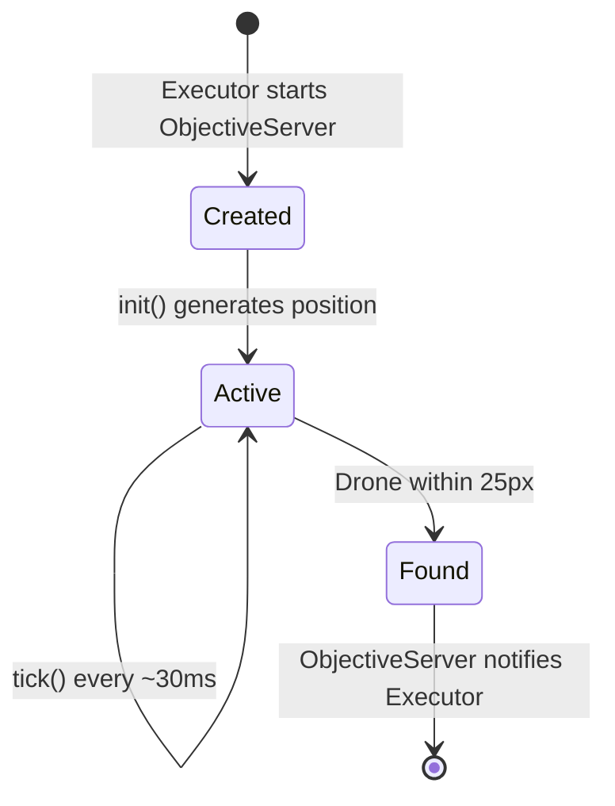
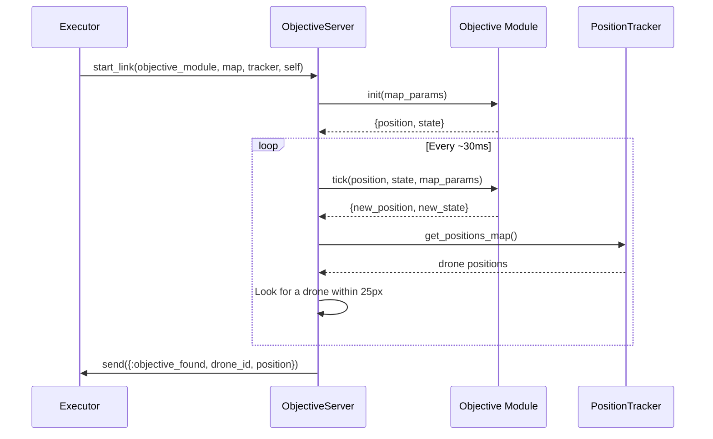

# Objective System

Objectives are physical entities inside the simulated world that drones must find.
They have pluggable behaviors — they can be static or move according to a pattern.
Each objective is an Elixir module implementing the `Simulator.Objective` behaviour.

## Behaviour and Callbacks

### `init(map_params)` — required

Generates the objective's initial position and internal state.

**Input:**
- `map_params` — `%Simulator.Maps.MapParams{width, height, structures}`

**Return:**
- `{position, state}` — `%{x, y}` position and `map()` internal state

### `tick(position, state, map_params)` — required

Advances the objective by one tick. Static objectives return the position unchanged.
Moving objectives compute their new position.

**Return:**
- `{new_position, new_state}`

## Objective Registry

Objectives are registered in `Simulator.Objectives` (`lib/simulator/objectives/objectives.ex`):

```elixir
@available_objectives %{
  "static" => StaticObjective,
  "aim_random_walk" => AimRandomWalkObjective
}
```

- `get_objective("none")` returns `nil` — simulation without an objective
- `get_objective("static")` returns `Simulator.Objectives.StaticObjective`
- `get_available_objectives_keys/0` returns `["none", "static", "aim_random_walk"]`

## Objective Lifecycle





## Detection

The `ObjectiveServer` simulates sensor-based detection:

1. Reads all drone positions from the `PositionTracker`
2. Filters out disconnected drones (`disconnected: true`)
3. Computes the Euclidean distance between the objective and each active drone
4. If any drone is within `@detection_radius` (25px), it considers it the "finder"
5. Notifies the Executor with `{:objective_found, drone_id, position}`

Drones **don't know** where the objective is. Discovery happens through physical
proximity, simulating a real sensor. After detection, the Executor notifies all
drones via `receive_shared_data(:environment, %{type: :objective_found, position: pos})`.

## Implementing a New Objective

1. Create a module under `lib/simulator/objectives/impl/`:

```elixir
defmodule Simulator.Objectives.MyObjective do
  @moduledoc "Description of the objective."
  @behaviour Simulator.Objective

  alias Simulator.Algorithms.Helpers.Geometry

  @impl true
  def init(map_params) do
    fallback = %{x: div(map_params.width, 2), y: div(map_params.height, 2)}
    position = Geometry.random_open_point(map_params, fallback)
    {position, %{}}
  end

  @impl true
  def tick(position, state, _map_params) do
    # Movement logic (or return unchanged for a static objective)
    {position, state}
  end
end
```

2. Register it in `@available_objectives` in `lib/simulator/objectives/objectives.ex`
3. Add the alias to the import list of the `Simulator.Objectives` module

## Implementations

| Objective | Movement | Internal state | Description |
|-----------|:--------:|:--------------:|-------------|
| StaticObjective | No | — | Fixed random position, never moves |
| AimRandomWalkObjective | Yes | target | Walks toward random targets, avoids obstacles |

### StaticObjective

**Module:** `Simulator.Objectives.StaticObjective`
**File:** `lib/simulator/objectives/impl/static_objective.ex`

Generates a random open position (outside structures) on initialization and never
moves. The simplest objective — drones must find a fixed point.

### AimRandomWalkObjective

**Module:** `Simulator.Objectives.AimRandomWalkObjective`
**File:** `lib/simulator/objectives/impl/aim_random_walk_objective.ex`

Reuses the same logic as the `AimRandomWalk` algorithm: picks a random target,
walks toward it step by step (`@step_size: 3`), and on arrival or obstacle
collision, generates a new target. It moves slower than the drones (`step_size: 3`
vs `5`) to remain findable.

It uses `Geometry.step_toward/4`, `Geometry.path_collides?/3`, and
`Geometry.random_open_point/3` — the same utilities available to movement algorithms.
