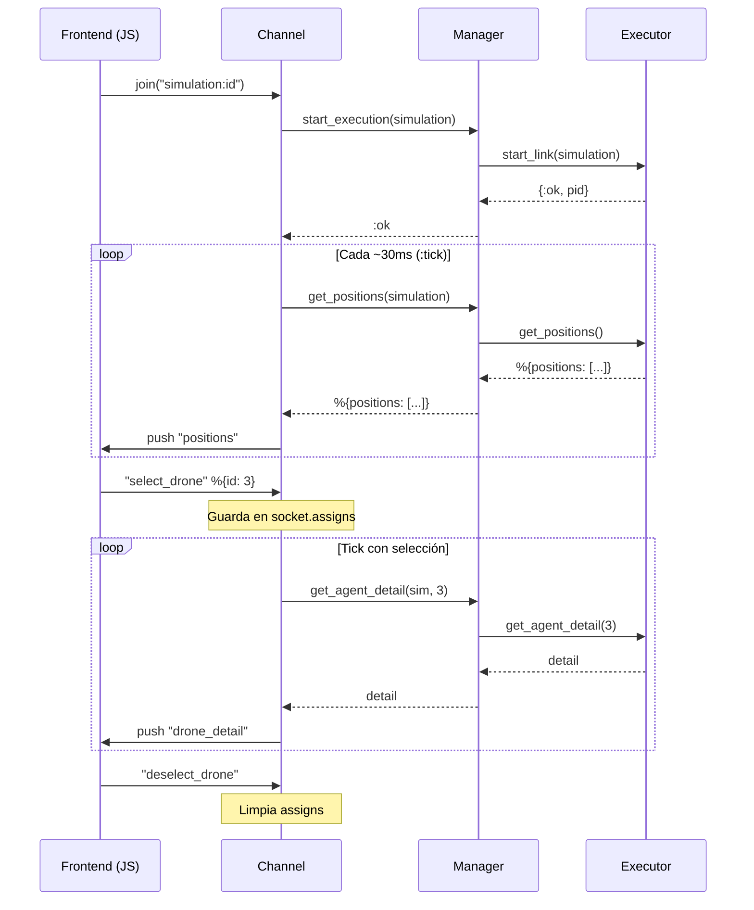
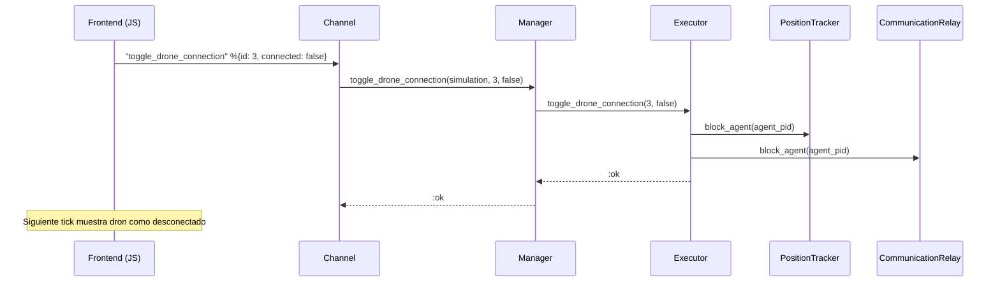
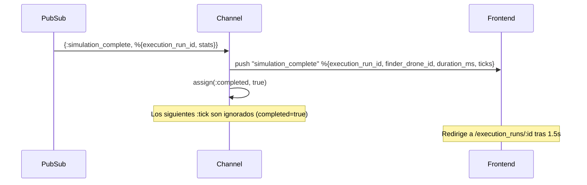

# Channels (WebSocket)

## Conexión

- **Endpoint:** `/socket` (UserSocket)
- **Archivo socket:** `lib/simulator_web/channels/user_socket.ex`

## SimulationChannel

**Módulo:** `SimulatorWeb.SimulationChannel`
**Archivo:** `lib/simulator_web/channels/simulation_channel.ex`
**Topic:** `"simulation:<id>"`

### Join

Al unirse al channel (`join/3`):
1. Carga la simulación desde la DB
2. Suscribe al topic PubSub `"simulation:<id>"` para recibir eventos de completitud
3. Llama `SimulationManager.start_execution(simulation)` — si ya existe, retorna el Executor existente
4. Programa el primer `:tick`
5. Inicializa `completed: false` en assigns
6. Retorna `:ok`

### Tick Loop

Cada `@tick_interval` ms (configurable via `Application.compile_env(:simulator, :tick_interval, 30)`):

1. `SimulationManager.get_positions(simulation)` → posiciones de todos los agentes
2. `push(socket, "positions", %{positions: positions})` → envía al frontend
3. Si hay un dron seleccionado, obtiene su detalle y hace push de `"drone_detail"`
4. Programa el siguiente tick

### Eventos Entrantes (frontend → backend)

| Evento | Payload | Efecto |
|--------|---------|--------|
| `"select_drone"` | `%{"id" => integer}` | Almacena el ID del dron seleccionado en `socket.assigns` |
| `"deselect_drone"` | `%{}` | Limpia la selección |
| `"toggle_drone_connection"` | `%{"id" => integer, "connected" => boolean}` | Desconecta/reconecta un dron via SimulationManager → Executor |

### Eventos Salientes (backend → frontend)

| Evento | Payload | Frecuencia |
|--------|---------|------------|
| `"positions"` | `%{positions: [%{x, y, color, id}], objective: %{x, y} \| nil}` | Cada tick |
| `"drone_detail"` | `%{id, position, neighbors_count, algorithm_state, disconnected}` | Cada tick (si hay selección) |
| `"simulation_complete"` | `%{execution_run_id, finder_drone_id, duration_ms, ticks}` | Una vez (al encontrar objetivo) |

### Diagrama de flujo (secuencia)

### Toggle Drone Connection

### Evento simulation_complete (PubSub → Channel → Frontend)

### Notas

- El concepto de "dron seleccionado" vive exclusivamente en la capa web
  (`socket.assigns.selected_drone`). El backend expone un query genérico
  `get_agent_detail` que no sabe sobre selección.
- El channel no controla comportamiento de drones — solo observa y transmite.
- `toggle_drone_connection` es la excepción: permite desconectar/reconectar un dron del
  entorno. El estado de conexión (`disconnected`) se incluye en `drone_detail` y en las
  posiciones (como flag en el PositionTracker), permitiendo al frontend mostrar el estado visual.
- Cuando se recibe `simulation_complete`, el channel deja de hacer ticks (`completed: true`
  en assigns). El frontend redirige automáticamente a la pantalla de estadísticas.
- El campo `objective` en el payload de `"positions"` solo está presente cuando la simulación
  tiene un objetivo activo. Contiene `%{x, y}` con la posición actual del objetivo.
