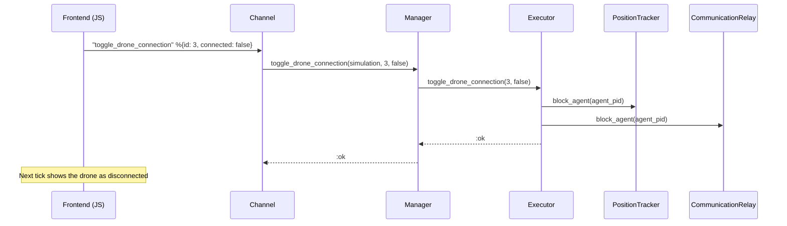
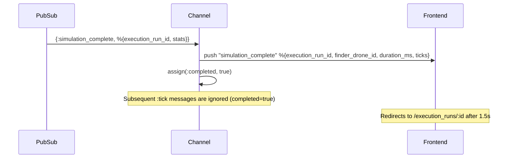

# Channels (WebSocket)

## Connection

- **Endpoint:** `/socket` (UserSocket)
- **Socket file:** `lib/simulator_web/channels/user_socket.ex`

## SimulationChannel

**Module:** `SimulatorWeb.SimulationChannel`
**File:** `lib/simulator_web/channels/simulation_channel.ex`
**Topic:** `"simulation:<id>"`

### Join

When joining the channel (`join/3`):
1. Loads the simulation from the DB
2. Subscribes to the PubSub topic `"simulation:<id>"` to receive completion events
3. Calls `SimulationManager.start_execution(simulation)` — if it already exists, returns the existing Executor
4. Schedules the first `:tick`
5. Initializes `completed: false` in assigns
6. Returns `:ok`

### Tick Loop

Every `@tick_interval` ms (configurable via `Application.compile_env(:simulator, :tick_interval, 30)`):

1. `SimulationManager.get_positions(simulation)` → positions of all agents
2. `push(socket, "positions", %{positions: positions})` → sends to the frontend
3. If a drone is selected, retrieves its detail and pushes `"drone_detail"`
4. Schedules the next tick

### Incoming Events (frontend → backend)

| Event | Payload | Effect |
|-------|---------|--------|
| `"select_drone"` | `%{"id" => integer}` | Stores the selected drone ID in `socket.assigns` |
| `"deselect_drone"` | `%{}` | Clears the selection |
| `"toggle_drone_connection"` | `%{"id" => integer, "connected" => boolean}` | Disconnects/reconnects a drone via SimulationManager → Executor |

### Outgoing Events (backend → frontend)

| Event | Payload | Frequency |
|-------|---------|-----------|
| `"positions"` | `%{positions: [%{x, y, color, id}], objective: %{x, y} \| nil}` | Every tick |
| `"drone_detail"` | `%{id, position, neighbors_count, algorithm_state, disconnected}` | Every tick (if there is a selection) |
| `"simulation_complete"` | `%{execution_run_id, finder_drone_id, duration_ms, ticks}` | Once (when the objective is found) |

### Flow Diagram (sequence)

### Toggle Drone Connection

### simulation_complete event (PubSub → Channel → Frontend)

### Notes

- The "selected drone" concept lives exclusively in the web layer
  (`socket.assigns.selected_drone`). The backend exposes a generic
  `get_agent_detail` query that knows nothing about selection.
- The channel does not control drone behavior — it only observes and transmits.
- `toggle_drone_connection` is the exception: it allows disconnecting/reconnecting a
  drone from the environment. The connection state (`disconnected`) is included in
  `drone_detail` and in the positions (as a flag in the PositionTracker), letting
  the frontend display the visual state.
- When `simulation_complete` is received, the channel stops ticking (`completed: true`
  in assigns). The frontend automatically redirects to the stats screen.
- The `objective` field in the `"positions"` payload is only present when the
  simulation has an active objective. It contains `%{x, y}` with the objective's
  current position.
