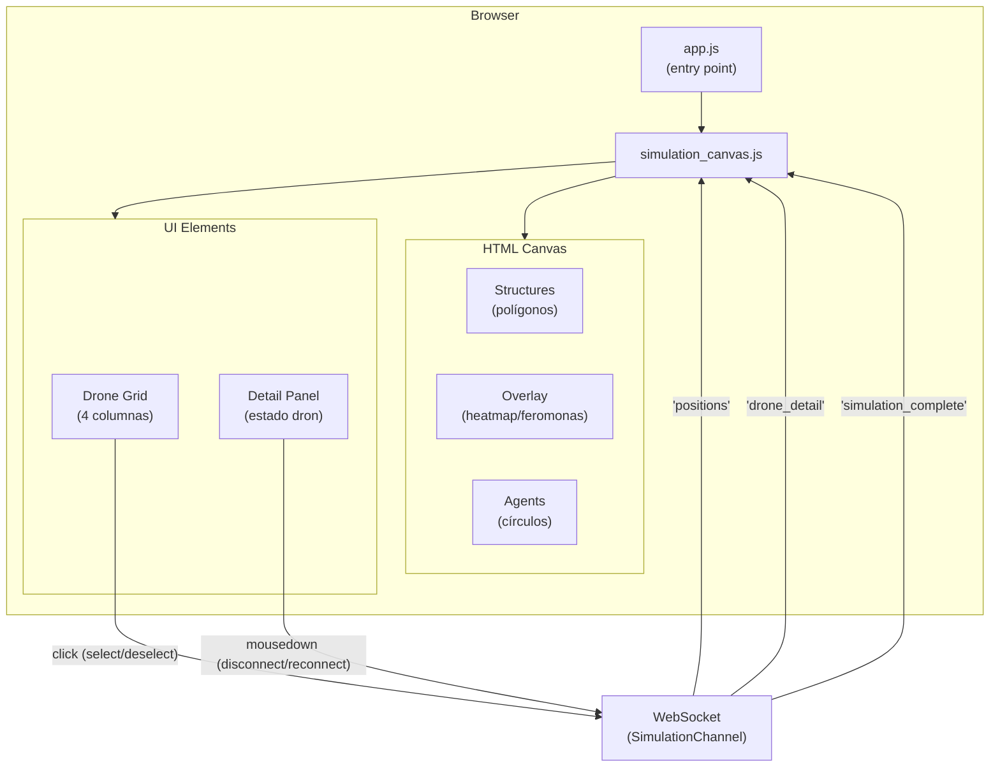

# Frontend

**Directorio:** `assets/js/`

## Archivos

| Archivo | Descripción |
|---------|-------------|
| `app.js` | Entry point — importa Phoenix Socket, LiveView, topbar, y simulation canvas |
| `simulation_canvas.js` | Conecta al SimulationChannel via WebSocket, renderiza agentes y estructuras en HTML Canvas |

## Arquitectura del Frontend



## Canvas de Simulación

### Renderizado de Estructuras

Las estructuras del mapa (obstáculos) se dibujan como polígonos:
- **Fill:** gris con opacidad 0.3
- **Stroke:** gris con opacidad 0.8

### Renderizado de Agentes

Cada agente se dibuja como dos círculos concéntricos:
- **Círculo externo:** radio 20px, solo stroke
- **Círculo interno:** radio 5px, filled

### Renderizado de Objetivo

Cuando la simulación tiene un objetivo, se dibuja como un marcador rojo:
- **Círculo externo:** radio 15px, solo stroke, color `#ef4444`
- **Círculo interno:** radio 6px, filled, color `#ef4444`

Se dibuja después de structures/overlay y antes de los agentes. La posición se
actualiza en cada tick a partir del campo `objective` del evento `"positions"`.

### Colores de Agentes

| Estado | Color | Hex |
|--------|-------|-----|
| Solo (sin vecinos) | Violeta | `#6366f1` |
| Con vecinos | Verde | `#22c55e` |
| Seleccionado | Ámbar | `#f59e0b` |
| Desconectado | Gris | `#9ca3af` |

Los drones desconectados se muestran con opacidad reducida (0.4) tanto en el canvas como
en el drone grid, a menos que estén seleccionados.

### Overlays

Cuando un dron con overlay está seleccionado, se dibuja información adicional sobre el canvas.
El overlay viene pre-computado del servidor como parte de `format_state/1` del algoritmo, con
la estructura `%{cells: [%{x, y, intensity}], color: "r, g, b"}`. El frontend renderiza
genéricamente sin conocer qué algoritmo lo generó:

- Cada celda se dibuja como un rectángulo semi-transparente con opacidad proporcional a `intensity`
- El color es definido por el algoritmo (e.g., rojo para heatmap, azul para feromonas)

## Drone Grid

Debajo del canvas se muestra un grid de 4 columnas con los IDs de los drones:
- Cada dron tiene un dot con código de color (mismo esquema que el canvas)
- Click en un dron togglea la selección (envía `select_drone`/`deselect_drone` al channel)
- Los drones desconectados se muestran en gris con opacidad reducida

## Panel de Detalle

Cuando un dron está seleccionado, se muestra un panel con:
- Estado de conexión (badge "Connected" verde o "Disconnected" rojo)
- Posición (`x`, `y`)
- Cantidad de vecinos
- Campos del algoritmo (renderizados genéricamente desde `detail_fields` de `format_state/1`)
- Botón de toggle: "Disconnect" (rojo) si conectado, "Reconnect" (verde) si desconectado

Los campos del algoritmo se renderizan según su tipo:

| Tipo | Renderizado |
|------|-------------|
| `"text"` | Valor como string plano |
| `"position"` | `(x, y)` |
| `"badge"` | Badge estilizado |
| `"boolean"` | "Yes" / "No" |

El frontend no tiene lógica específica por algoritmo — cada algoritmo define qué exponer
en su `format_state/1` y el frontend lo renderiza genéricamente.

## Ciclo de Renderizado

```
Channel push "positions"
    │
    ▼
JS recibe evento
    │
    ├── Clear canvas
    ├── Draw structures (polígonos grises)
    ├── Draw overlay (si hay dron seleccionado con overlay data)
    ├── Draw objective (círculo rojo, si hay objetivo)
    ├── Draw agents (círculos concéntricos por agente)
    │     └── Drones desconectados: color gris, opacidad 0.4
    └── Update drone grid + detail panel
          └── Drones desconectados: gris, opacidad reducida, botón "Reconnect"
```

El renderizado ocurre a ~30fps, sincronizado con el tick del channel.

## Evento simulation_complete

Cuando el backend envía `"simulation_complete"`, el frontend redirige automáticamente
a la pantalla de estadísticas (`/execution_runs/:id`) después de un delay de 1.5 segundos,
permitiendo al usuario ver brevemente el momento de la detección.

```
Channel push "simulation_complete" {execution_run_id}
    │
    ├── setTimeout(1500ms)
    └── window.location.href = /execution_runs/:id
```
