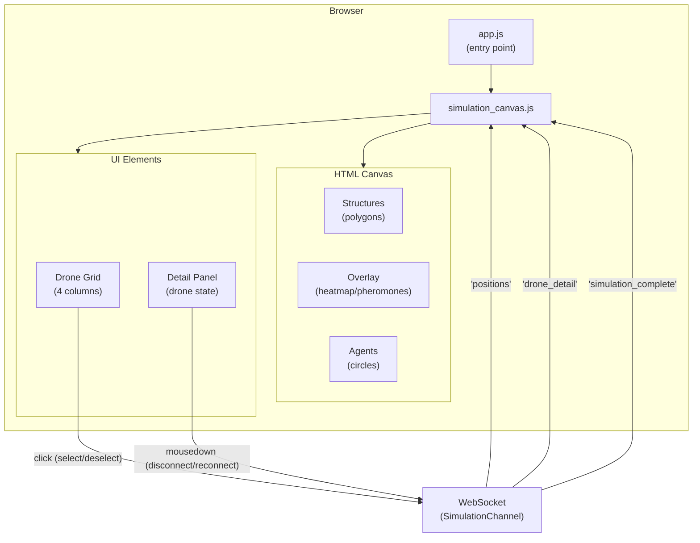

# Frontend

**Directory:** `assets/js/`

## Files

| File | Description |
|------|-------------|
| `app.js` | Entry point — imports Phoenix Socket, LiveView, topbar, and the simulation canvas |
| `simulation_canvas.js` | Connects to the SimulationChannel via WebSocket, renders agents and structures on an HTML Canvas |

## Frontend Architecture



## Simulation Canvas

### Structure Rendering

Map structures (obstacles) are drawn as polygons:
- **Fill:** gray with opacity 0.3
- **Stroke:** gray with opacity 0.8

### Agent Rendering

Each agent is drawn as two concentric circles:
- **Outer circle:** radius 20px, stroke only
- **Inner circle:** radius 5px, filled

### Objective Rendering

When the simulation has an objective, it is drawn as a red marker:
- **Outer circle:** radius 15px, stroke only, color `#ef4444`
- **Inner circle:** radius 6px, filled, color `#ef4444`

It is drawn after structures/overlay and before the agents. The position is updated
on every tick from the `objective` field of the `"positions"` event.

### Agent Colors

| State | Color | Hex |
|-------|-------|-----|
| Alone (no neighbors) | Violet | `#6366f1` |
| With neighbors | Green | `#22c55e` |
| Selected | Amber | `#f59e0b` |
| Disconnected | Gray | `#9ca3af` |

Disconnected drones are shown with reduced opacity (0.4) on both the canvas and
the drone grid, unless they are selected.

### Overlays

When a drone with an overlay is selected, additional information is drawn on top
of the canvas. The overlay comes pre-computed from the server as part of the
algorithm's `format_state/1`, with the structure
`%{cells: [%{x, y, intensity}], color: "r, g, b"}`. The frontend renders it
generically without knowing which algorithm produced it:

- Each cell is drawn as a semi-transparent rectangle with opacity proportional to `intensity`
- The color is defined by the algorithm (e.g., red for heatmap, blue for pheromones)

## Drone Grid

Below the canvas, a 4-column grid shows the drone IDs:
- Each drone has a color-coded dot (same scheme as the canvas)
- Clicking on a drone toggles selection (sends `select_drone`/`deselect_drone` to the channel)
- Disconnected drones are shown in gray with reduced opacity

## Detail Panel

When a drone is selected, a panel is shown with:
- Connection state (green "Connected" or red "Disconnected" badge)
- Position (`x`, `y`)
- Neighbor count
- Algorithm fields (rendered generically from `detail_fields` of `format_state/1`)
- Toggle button: "Disconnect" (red) if connected, "Reconnect" (green) if disconnected

Algorithm fields are rendered according to their type:

| Type | Rendering |
|------|-----------|
| `"text"` | Value as a plain string |
| `"position"` | `(x, y)` |
| `"badge"` | Styled badge |
| `"boolean"` | "Yes" / "No" |

The frontend has no algorithm-specific logic — each algorithm defines what to
expose in its `format_state/1` and the frontend renders it generically.

## Render Cycle

```
Channel push "positions"
    │
    ▼
JS receives event
    │
    ├── Clear canvas
    ├── Draw structures (gray polygons)
    ├── Draw overlay (if a drone with overlay data is selected)
    ├── Draw objective (red circle, if there is an objective)
    ├── Draw agents (concentric circles per agent)
    │     └── Disconnected drones: gray color, opacity 0.4
    └── Update drone grid + detail panel
          └── Disconnected drones: gray, reduced opacity, "Reconnect" button
```

Rendering happens at ~30fps, synchronized with the channel tick.

## simulation_complete event

When the backend sends `"simulation_complete"`, the frontend automatically redirects
to the stats screen (`/execution_runs/:id`) after a 1.5-second delay, letting the
user briefly see the moment of detection.

```
Channel push "simulation_complete" {execution_run_id}
    │
    ├── setTimeout(1500ms)
    └── window.location.href = /execution_runs/:id
```
