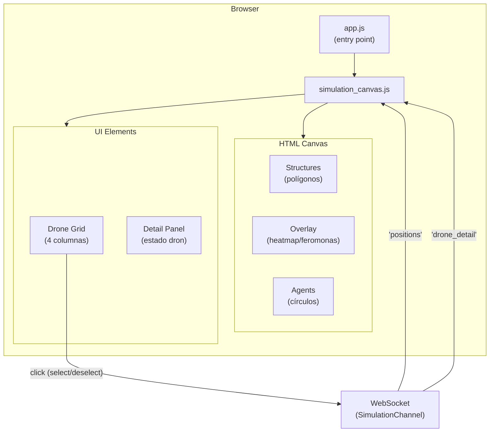

# Frontend

**Directorio:** `assets/js/`

## Archivos

| Archivo | Descripción |
|---------|-------------|
| `app.js` | Entry point — importa Phoenix Socket, LiveView, topbar, y simulation canvas |
| `simulation_canvas.js` | Conecta al SimulationChannel via WebSocket, renderiza agentes y estructuras en HTML Canvas |

## Arquitectura del Frontend



## Canvas de Simulación

### Renderizado de Estructuras

Las estructuras del mapa (obstáculos) se dibujan como polígonos:
- **Fill:** gris con opacidad 0.3
- **Stroke:** gris con opacidad 0.8

### Renderizado de Agentes

Cada agente se dibuja como dos círculos concéntricos:
- **Círculo externo:** radio 20px, solo stroke
- **Círculo interno:** radio 5px, filled

### Colores de Agentes

| Estado | Color | Hex |
|--------|-------|-----|
| Solo (sin vecinos) | Violeta | `#6366f1` |
| Con vecinos | Verde | `#22c55e` |
| Seleccionado | Ámbar | `#f59e0b` |

### Overlays

Cuando un dron con overlay está seleccionado, se dibuja información adicional sobre el canvas:

- **Heatmap overlay** (HeatmapWalk): rectángulos semi-transparentes rojos con opacidad
  proporcional a la densidad de visitas por celda
- **Pheromone overlay** (AntColony): rectángulos con opacidad proporcional a la intensidad
  de feromona normalizada

## Drone Grid

Debajo del canvas se muestra un grid de 4 columnas con los IDs de los drones:
- Cada dron tiene un dot con código de color (mismo esquema que el canvas)
- Click en un dron togglea la selección (envía `select_drone`/`deselect_drone` al channel)

## Panel de Detalle

Cuando un dron está seleccionado, se muestra un panel con:
- Posición (`x`, `y`)
- Cantidad de vecinos
- Estado del algoritmo (formateado por `Algorithm.format_state/2`)

El contenido del estado del algoritmo varía según la implementación:
- **Static/RandomWalk:** sin estado adicional
- **AimRandomWalk:** target actual
- **HeatmapWalk:** posiciones visitadas (propias + recibidas combinadas)
- **AntColony:** pheromone overlay
- **ParticleSwarm:** objective_found
- **GreyWolf:** role, objective_found, target

## Ciclo de Renderizado

```
Channel push "positions"
    │
    ▼
JS recibe evento
    │
    ├── Clear canvas
    ├── Draw structures (polígonos grises)
    ├── Draw overlay (si hay dron seleccionado con overlay data)
    ├── Draw agents (círculos concéntricos por agente)
    └── Update drone grid + detail panel
```

El renderizado ocurre a ~30fps, sincronizado con el tick del channel.
